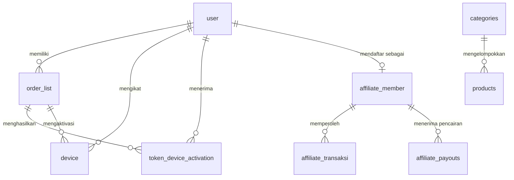

# DOKUMENTASI MASTER SISTEM APPCENTER V2
## Portal Ensiklopedia & Indeks Utama Ekosistem Terpadu

> [!IMPORTANT]
> Dokumentasi sistem AppCenter V2 telah dibagi menjadi 3 panduan komprehensif berkedalaman tinggi:
> 1. 📘 **[DOKUMENTASI TEKNIS MENDALAM & TESTING SUITE (22 Modul)](file:///Users/fiko942/Desktop/appcenter/docs/TECHNICAL_DOCUMENTATION.md)** — Rincian tech stack, instalasi & deployment, backend controllers, database Prisma, API contracts, HWID locking, rate limiting, SFTP multi-chunk, database streaming backup, serta 15 skenario pengujian E2E simulasi nyata dengan isolasi database produksi dan zero storage footprint.
> 2. 📗 **[DOKUMENTASI NON-TEKNIS & STRATEGI BISNIS](file:///Users/fiko942/Desktop/appcenter/docs/NON_TECHNICAL_DOCUMENTATION.md)** — Model bisnis SaaS, funnel konversi trial, sistem bagi hasil afiliasi, psikologi UI/UX, dan SOP operasional admin.
> 3. 🎨 **[DOKUMENTASI KOMPONEN UI & DESIGN SYSTEM](file:///Users/fiko942/Desktop/appcenter/docs/UI_COMPONENTS_AND_DESIGN_SYSTEM.md)** — Bedah komponen per komponen Svelte (`CustomSelect`, `CustomCheckbox`, `CustomDropdown`, `SegmentedTabs`, `ThemeToggle`, `Tooltip`, `Sidebar`, `AdminSidebar`, `Topbar`, `Layout`), tokens, animasi, CSS variables, dan keyframes.

---

## DAFTAR ISI
1. [Ringkasan Eksekutif & Analisis Non-Teknis](#1-ringkasan-eksekutif--analisis-non-teknis)
   - 1.1 Model Bisnis & Value Proposition
   - 1.2 User Persona & Customer Journey Funnel
   - 1.3 Mekanisme Monetisasi & Program Kemitraan Afiliasi
   - 1.4 Strategi Konversi Uji Coba (Trial-to-Paid Funnel)
2. [Analisis Teknis & Arsitektur Sistem](#2-analisis-teknis--arsitektur-sistem)
   - 2.1 Topologi Infrastruktur & Monorepo Single-Port
   - 2.2 Backend Engine (Express 5 + TypeScript + Prisma 6)
   - 2.3 Frontend SPA Architecture (Svelte 4 + Tailwind CSS 4)
   - 2.4 Sistem Otentikasi, Sesi, & Keamanan Multi-Role
   - 2.5 Manajemen Basis Data & Pool Connection Limit Invariant
   - 2.6 Engine Gateway Pembayaran (Xendit & Free Claim Rp 0)
   - 2.7 Engine Distribusi Berkas & Chunked SFTP Multi-OS Upload
   - 2.8 Engine Pencadangan Basis Data (Raw SQL Streaming & Audit Logger)
   - 2.9 Subsystem Ziqva OAuth 2.0 & Single Sign-On (SSO) IdP
3. [Kamus Basis Data & Relasi Entitas (Prisma ORM)](#3-kamus-basis-data--relasi-entitas-prisma-orm)
4. [Matriks Endpoint API & Kontrak Data](#4-matriks-endpoint-api--kontrak-data)
5. [Sistem UI/UX, Design Tokens, & Motion Guidelines](#5-sistem-uiux-design-tokens--motion-guidelines)
6. [Protokol Operasional, Invariant Permanen, & Standar Pemeliharaan](#6-protokol-operasional-invariant-permanen--standar-pemeliharaan)

---

## 1. RINGKASAN EKSEKUTIF & ANALISIS NON-TEKNIS

### 1.1 Model Bisnis & Value Proposition
AppCenter V2 adalah ekosistem digital terintegrasi untuk distribusi, monetisasi, dan proteksi perangkat lunak desktop (Windows & macOS). Platform ini menjembatani kreator software/automasi dengan end-user dan jaringan reseller/afiliasi.

- **Value Proposition bagi Pembeli/Pengguna**:
  - Akses instan ke katalog software desktop otomasi berkualitas tinggi.
  - Aktivasi perangkat mandiri (Self-Service HWID Binding) tanpa intervensi manual developer.
  - Kemudahan klaim tools gratis (Rp 0) untuk evaluasi fungsionalitas.
  - Pusat pembelajaran terpadu (Video Tutorial Hub interaktif) dan Download Hub berkecepatan tinggi.
- **Value Proposition bagi Mitra Afiliasi**:
  - Kupon diskon kustom yang dapat dibagikan kepada audiens.
  - Dashboard pemantauan transaksi komisi real-time dan riwayat payout transparan.
  - Penarikan dana fleksibel ke rekening bank nasional (BCA, Mandiri, BNI, BRI, dll.) dan e-wallet (Dana, OVO, GoPay).
- **Value Proposition bagi Administrator/Bisnis**:
  - Sentralisasi manajemen lisensi, order, produk, kategori, afiliasi, dan diagnostik server.
  - Generator lisensi trial instan dengan template chat WhatsApp siap kirim (format ramah & formal).
  - Sistem pencadangan basis data mandiri anti-korupsi berkeamanan tinggi dengan audit log download.

### 1.2 User Persona & Customer Journey Funnel

```mermaid
flowchart LR
    A["Pengunjung / Prospek"] -->|"Coba Gratis / Trial"| B["Download & Aktivasi Trial"]
    B -->|"Konversi Penggunaan"| C["Registrasi Akun Member"]
    C -->|"Pilih Software / Kupon"| D["Checkout (Xendit / Klaim Rp 0)"]
    D -->|"Aktivasi Otomatis"| E["Serial Key Terbit"]
    E -->|"Input di Desktop App"| F["HWID Terkunci & Software Aktif"]
    F -->|"Kemitraan"| G["Bergabung Program Afiliasi"]
```


1. **Top of Funnel (Eksplorasi & Trial)**:
   - Prospek mendapatkan penawaran software melalui media sosial atau mitra afiliasi.
   - Admin membuatkan token trial di generator lisensi admin.
   - Prospek mengunduh software dari portal publik dan mencoba fitur otomasi selama durasi uji coba.
2. **Middle of Funnel (Akuisisi & Onboarding)**:
   - Pengguna mendaftar akun di portal Member AppCenter.
   - Email pengguna dikunci permanen (`immutable`) untuk menjamin riwayat kepemilikan software dan integritas data order.
   - Pengguna dapat langsung mengklaim produk berstatus **Gratis (Rp 0)** tanpa perlu memasukkan kartu pembayaran.
3. **Bottom of Funnel (Monetisasi & Loyalitas)**:
   - Pengguna membeli lisensi premium melalui gateway Xendit (Virtual Account, QRIS, E-Wallet).
   - Segera setelah pembayaran lunas, lisensi software otomatis terbit di database dan siap dipakai.
   - Pengguna yang puas dapat mendaftar menjadi **Mitra Afiliasi** untuk mempromosikan software ke jaringan mereka.

### 1.3 Mekanisme Monetisasi & Program Kemitraan Afiliasi
- **Struktur Harga Produk**:
  - Berbasis durasi fleksibel: Bulanan (misal 30 hari), Tahunan (365 hari), atau Lisensi Penuh.
  - Dukungan produk gratis (`price = 0`) yang melewati gateway dan langsung menerbitkan token aktif.
- **Logika Afiliasi**:
  - Setiap mitra memiliki kupon unik (`kupon`), nominal diskon untuk pembeli (`kupon_decrease_value`), dan nominal komisi per penjualan (`kupon_income_idr`).
  - Saat pembeli menerapkan kupon di halaman checkout, sistem memvalidasi kupon di tabel `affiliate_member`.
  - Saat transaksi sukses, record komisi dicatat di `affiliate_transaksi` dengan status `already_paid = 0`.
  - Admin melakukan transfer komisi dan menandai payout di `AdminAffiliate.svelte`, yang mencatat riwayat ke `affiliate_payouts` dan menyetel `already_paid = 1` secara atomik.

### 1.4 Strategi Konversi Uji Coba (Trial-to-Paid Funnel)
- Modal sukses pembuatan trial di `AdminCreateTrial.svelte` secara cerdas merangkum:
  - Kode token trial tebal dengan feedback salin instan.
  - Perhitungan tanggal kedaluwarsa otomatis dalam zona waktu WIB (`calculateExpiryDate`).
  - Pratinjau visual pesan WhatsApp ramah & formal: salam pembuka hangat, petunjuk 3 langkah aktivasi, ketentuan HWID lock, dan tombol 1-klik `Salin Pesan WhatsApp` beraksen hijau emerald.

---

## 2. ANALISIS TEKNIS & ARSITEKTUR SISTEM

### 2.1 Topologi Infrastruktur & Monorepo Single-Port
- **Port 4829 Unified Monorepo**:
  - Express 5 menyajikan seluruh aset frontend Svelte 4 SPA yang telah dikompilasi ke `client/dist` dan fallback SSR HTML legacy (`src/views/*`).
  - API endpoint dipisahkan secara hierarkis:
    - `/member/api/*` — Khusus transaksi, profil, lisensi, dan unduhan member.
    - `/admin/api/*` — Khusus dashboard analitik, manajemen produk, user, pembayaran, backup, dan afiliasi.
    - `/device/*` — Khusus protokol desktop software checking dan license binding.
    - `/payment/*` — Khusus redirect pembayaran dan webhook callback Xendit.

### 2.2 Backend Engine (Express 5 + TypeScript + Prisma 6)
- **Modul Pengendali Terpusat**:
  - `AdminController` (`src/controllers/adminController.ts`): Menangani seluruh proses administrasi dengan perlindungan sesi dan rate limiter.
  - `MemberController` (`src/controllers/memberController.ts`): Menangani autentikasi member, registrasi, checkout pesanan, klaim gratis Rp 0, dan visualisasi lisensi.
  - `DeviceController` (`src/controllers/deviceController.ts`): Handshake status perangkat (`/status`) dan aktivasi serial key HWID (`/activation`).
  - `BackupService` (`src/services/backupService.ts`): Engine streaming pencadangan database MySQL tanpa kompresi gzip.
  - `SftpService` (`src/services/sftpService.ts`): Engine streaming berkas installer 5MB chunk ke storage remote VPS.

### 2.3 Frontend SPA Architecture (Svelte 4 + Tailwind CSS 4)
- **Komponen Svelte SPA Router**:
  - Hash routing (`#/member/...`, `#/admin/...`) via `svelte-spa-router`.
  - Auth guards otomatis (`requireMemberAuth`, `requireAdminAuth`, `redirectIfMemberAuth`, `redirectIfAdminAuth`) mencegah akses liar atau loop redirect.
- **Custom Svelte Component Suite**:
  - `CustomSelect.svelte`: Pengganti native `<select>` dengan animasi sliding pill, deteksi ruang viewport bawah (`getBoundingClientRect` upward opening), dan pencarian.
  - `CustomCheckbox.svelte`: Checkbox custom dengan tactile check feedback, 4 palet warna (brand, emerald, amber, rose), dan keyboard accessibility (Space/Enter).
  - `CustomDropdown.svelte`: Dropdown seleksi produk kaya media dengan gambar cover, format harga Rupiah, live debounced search, dan count pengguna aktif.
  - `SegmentedTabs.svelte`: Tab navigasi horizontal dengan sliding pill indicator beranimasi halus (cubic-bezier easing).

### 2.4 Sistem Otentikasi, Sesi, & Keamanan Multi-Role
- **Admin Security**:
  - Login menggunakan **6-Digit PIN** (Default Dev: `085213`).
  - `AdminRateLimiter`: Membatasi maksimal 3 percobaan salah per IP dengan eskalasi lockout (3m -> 5m -> 10m -> 15m).
  - Manajemen akun admin jamak (Super Admin) dengan fitur reset PIN dan pencatatan IP login terakhir.
- **Member Security**:
  - Otentikasi akun via email & password.
  - Email bersifat permanen & terkunci pasca pendaftaran.
  - Sesi disimpan secara terpusat di tabel basis data MySQL `app_admin_session` dan `labs_membership_session` via `express-mysql-session`.

### 2.5 Manajemen Basis Data & Pool Connection Limit Invariant
- **Batas Pool Maksimal 5 Koneksi**:
  - Baik `.env` (`DATABASE_URL=...?connection_limit=5`) maupun `src/app.ts` (`connectionLimit: 5`) dikunci pada nilai `5`.
  - Mencegah socket exhaustion pada shared VPS MySQL.
  - Optimalisasi algoritma O(1) Hash Map di seluruh controller (eliminasi loop kuadratik $O(N \times M)$ pada agregasi transaksi dan lisensi).

### 2.6 Engine Gateway Pembayaran (Xendit & Free Claim Rp 0)
- **Xendit Integration Flow**:
  - Backend membuat Invoice / Payment Request ke endpoint API resmi Xendit dengan timeout 10 detik (`AbortSignal.timeout(10000)`).
  - Pelanggan membayar via Virtual Account, QRIS, atau E-Wallet.
  - Xendit mengirim webhook ke `POST /payment/success`.
  - Sistem melakukan verifikasi token webhook (`xenditConfig.webhookToken`) dan eksekusi atomic status check (`status: { not: 'Order has been complete' }`) guna mencegah duplikasi lisensi.
- **Alur Order Gratis (Rp 0)**:
  - Jika produk berharga Rp 0, sistem langsung menyelesaikan order secara instan (`status = 'Order has been complete'`, `payment = 'PAID'`), membuat token lisensi, dan mengarahkan pengguna ke halaman Lisensi tanpa memanggil gateway Xendit.

### 2.7 Engine Distribusi Berkas & Chunked SFTP Multi-OS Upload
- **Spesifikasi Server SFTP**:
  - Host: `127.0.0.1:22` (User: `ziqva-apps-upload`, Path: `/var/www/html/setup-windows-bin/x86`).
  - Domain Unduhan: `https://download.ziqva.com/setup-windows-bin/x86/[filename]`.
- **Mekanisme Chunk Upload 5MB**:
  - Berkas installer besar (hingga 500MB+) dipecah di browser menjadi potongan 5MB.
  - Potongan diunggah secara berurutan ke backend (`/admin/api/products/:id/upload-chunk`), digabungkan menggunakan stream backpressure (`fs.createReadStream` + `pipe`), dan ditransfer via SFTP `fastPut`.
  - Direktori chunk temporary dibersihkan otomatis.

### 2.8 Engine Pencadangan Basis Data (Raw SQL Streaming & Audit Logger)
- **Format Raw SQL Murni (`.sql`)**:
  - Menghindari risiko file korup saat ekstraksi arsip gzip.
  - Streaming asinkron tabel demi tabel dengan live progress polling (0% - 100%).
  - Dukungan auto-prerequisites Linux VPS (`mysqldump` / `mariadb-dump` / fallback native TypeScript stream).
  - Verifikasi integritas checksum hash SHA-256.
  - Pelacakan audit log download lengkap (Waktu, Admin, IP, Browser, User-Agent) yang disimpan dalam format JSON `download_history`.

### 2.9 Subsystem Ziqva OAuth 2.0 & Single Sign-On (SSO) IdP
- **Penyedia Identitas Terpusat (*Centralized Identity Provider*)**:
  - Menyediakan layanan otentikasi terpusat bagi seluruh ekosistem Ziqva (Web, Desktop Electron, Mobile Flutter, API) dengan arsitektur menyerupai Google Sign-In (`accounts.google.com`).
  - Standar kepatuhan penuh terhadap **RFC 6749 (OAuth 2.0)**, **RFC 7636 (PKCE S256)**, dan **RFC 7009 (Token Revocation)**.
- **Dedicated In-Place SSO Modal & Account Chooser (`/#/oauth/authorize`)**:
  - Alur otorisasi tidak pernah dialihkan ke `/member/login`, melainkan menggunakan dialog interaktif dedicated.
  - Mode unauthenticated menampilkan form login inline dengan rate limiting.
  - Mode authenticated menampilkan kartu *Account Chooser* dengan badge avatar inisial dinamis, tombol "Lanjutkan sebagai [Nama]", dan opsi "Ganti Akun" tanpa merusak alur state.
  - Mengharuskan konfirmasi manual (*No Silent Auto-Login*).
- **Keamanan Ketat & Zero Database Integer ID Leakage**:
  - Melindungi integritas data dengan **tidak pernah mengekspos integer auto-increment database (`id`/`sub`)** ke endpoint publik `GET /oauth/userinfo`.
  - Menggunakan alamat `email` terverifikasi sebagai kunci identitas unik pengguna.
- **Global SSO Logout (`GET/POST /oauth/logout`)**:
  - Mendukung redirect pemutusan sesi IdP (`redirect_uri` / `post_logout_redirect_uri`) untuk mencegah infinite loop saat pengguna logout dari aplikasi klien.
- **Admin Developer Hub (`AdminOAuthClients.svelte`)**:
  - Manajemen penuh aplikasi klien (Confidential & Public PKCE), generator prompt AI (*Vibe-Coder Master Brief*) untuk integrasi `/writing-plans` di 6 framework, pratinjau live consent dialog, dan unduhan spesifikasi teknis Markdown.

---

## 3. KAMUS BASIS DATA & RELASI ENTITAS (PRISMA ORM)



| Nama Tabel | Deskripsi | Kolom Kunci | Tipe Data Utama |
| :--- | :--- | :--- | :--- |
| `products` | Katalog software | `id`, `name`, `price`, `image`, `tutorials`, `installer_files`, `category_id`, `is_active` | `Int`, `String`, `Float`, `LongText`, `Boolean` |
| `categories` | Kategori software | `id`, `name`, `slug`, `icon`, `is_active`, `created_at` | `Int`, `VarChar(191)`, `LongText`, `Boolean` |
| `order_list` | Transaksi pesanan | `id`, `user`, `items`, `status`, `payment`, `total_amount`, `payment_request_id`, `paid_at` | `Int`, `LongText`, `VarChar`, `Int` |
| `token_device_activation` | Serial key lisensi | `id`, `token`, `order_id`, `duration`, `product`, `user`, `taked`, `taked_at`, `taked_ip` | `Int`, `LongText`, `TinyText`, `Int` |
| `device` | HWID perangkat aktif | `id`, `order_id`, `email`, `machine_id`, `product`, `created`, `expired`, `duration`, `label` | `Int`, `LongText`, `VarChar(255)` |
| `trial` | Kunci uji coba | `id`, `token`, `product`, `user`, `machine_id`, `created`, `expired` | `Int`, `VarChar(255)`, `Text` |
| `affiliate_member` | Mitra afiliasi | `id`, `email`, `unix`, `kupon`, `kupon_decrease_value`, `kupon_income_idr`, `payout_bank_name`, `payout_no_rek`, `payout_name` | `Int`, `VarChar(255)` |
| `affiliate_transaksi` | Komisi pesanan | `id`, `product_name`, `affiliate_income`, `invoice_code`, `already_paid`, `affiliator_email`, `customer_email` | `Int`, `VarChar(255)` |
| `affiliate_payouts` | Riwayat pencairan | `id`, `created`, `affiliate_email`, `accepted_by`, `note`, `amount` | `Int`, `VarChar(255)` |
| `database_backups` | Log backup & audit | `id`, `filename`, `file_path`, `file_size`, `checksum_sha256`, `table_count`, `record_count`, `status`, `progress`, `download_history` | `Int`, `VarChar(255)`, `BigInt`, `LongText` |
| `user` | Pengguna member | `id`, `original_id`, `email`, `password`, `verified`, `banned`, `created`, `ip`, `name`, `avatar`, `whatsapp`, `company` | `Int`, `LongText`, `Boolean`, `VarChar(255)` |
| `admin` | Pengelola sistem | `id`, `username`, `password`, `pin`, `role`, `ip` | `Int`, `LongText`, `VarChar(10)` |

---

## 4. MATRIKS ENDPOINT API & KONTRAK DATA

### 4.1 Autentikasi & Portal Member (`/member/api/*`)
- `GET /member/api/session` — Cek status sesi login member.
- `GET /member/api/dashboard` — Mengambil data ringkasan akun, metrik order, lisensi, dan kategori software dinamis.
- `GET /member/api/products` — Mengambil katalog software aktif beserta metadata installer dan tutorial.
- `GET /member/api/tutorials` — Mengambil video playlist tutorial YouTube per produk software.
- `GET /member/api/downloads` — Mengambil daftar berkas installer software resmi.
- `GET /member/api/orders` — Mengambil riwayat pesanan (Server-Side Pagination, Sort, Search).
- `GET /member/api/licenses` — Mengambil daftar lisensi serial key dan status masa aktif perangkat PC.
- `POST /member/api/check-voucher` — Memvalidasi kode kupon diskon afiliasi.
- `POST /member/orders/create` — Membuat pesanan baru (Xendit Invoice atau Instant Free Claim Rp 0).

### 4.2 Pusat Kendali Administrator (`/admin/api/*`)
- `GET /admin/api/session` — Cek status otentikasi sesi admin.
- `GET /admin/api/login-status` — Cek sisa kuota percobaan login IP dan status lockout.
- `POST /admin/login` — Verifikasi PIN 6-digit keamanan admin.
- `GET /admin/api/dashboard` — Metrik statistik omset, order, lisensi, dan server performance.
- `GET /admin/api/users` — Server-Side User Management (Pencarian, Filter Banned/Verified, Sort, Pagination).
- `POST /admin/api/users/:id/ban` — Toggle status banned pengguna.
- `POST /admin/api/users/:id/reset-password` — Reset kata sandi member.
- `GET /admin/api/payments` — Server-Side Transaction Management (Pencarian, Status Filter, Detail Modal).
- `POST /admin/api/payments/confirm/:id` — Konfirmasi manual pembayaran pesanan.
- `GET /admin/api/products` — Server-Side Product Catalog Management.
- `POST /admin/api/products/create` — Tambah produk baru (Mendukung harga Rp 0).
- `POST /admin/api/products/:id/upload-chunk` — Multi-chunk 5MB SFTP installer upload.
- `GET /admin/api/categories` — Manajemen Kategori Produk (Tambah, Edit, Hapus, Toggle Status, Upload Icon).
- `GET /admin/api/affiliate` — Server-Side Affiliate Management (Mitra, Saldo Pending, Filter Bank, Payout Action).
- `GET /admin/api/affiliate/history` — Server-Side Affiliate Payout Log.
- `GET /admin/api/trials/products` — Produk dan riwayat token uji coba.
- `POST /admin/api/trials/create` — Pembuatan token trial (15 Menit s/d 1 Tahun).
- `GET /admin/api/profile` — Profil Admin, ubah username, dan ubah PIN keamanan 6-digit.
- `GET /admin/api/settings/backups` — Daftar riwayat pencadangan basis data.
- `POST /admin/api/settings/backup/create` — Memicu proses backup database asinkron.
- `GET /admin/api/settings/backup/status/:id` — Polling live progress backup.
- `GET /admin/api/settings/backup/download/:id` — Unduh file backup raw SQL + pencatatan audit log.

### 4.3 Desktop Software Integration (`/device/*`)
- `POST /device/status?product=[name]&machine_id=[hwid]` — Handshake status keaktifan lisensi perangkat.
- `POST /device/activation?token=[key]&product=[name]&machine_id=[hwid]` — Aktivasi serial key dan pengikatan HWID mesin.

---

## 5. SISTEM UI/UX, DESIGN TOKENS, & MOTION GUIDELINES

### 5.1 Design Tokens (Dual Theme Variables)
```css
:root {
  --bg: #f8fafc;
  --surface: #ffffff;
  --surface-2: #f1f5f9;
  --border: #e2e8f0;
  --brand: #2563eb;
  --brand-soft: rgba(37, 99, 235, 0.08);
  --text: #0f172a;
  --text-2: #334155;
  --text-3: #64748b;
}

[data-theme="dark"] {
  --bg: #070c16;
  --surface: #0c1426;
  --surface-2: #101827;
  --border: #22314d;
  --brand: #3b82f6;
  --brand-soft: rgba(59, 130, 246, 0.12);
  --text: #f8fafc;
  --text-2: #cbd5e1;
  --text-3: #94a3b8;
}
```

### 5.2 Motion & Micro-Interactions
- **Framer-Motion Style Sliding Pills**:
  - Komponen `SegmentedTabs`, `CustomSelect`, `CustomDropdown`, `AdminSidebar`, dan `Sidebar` menggunakan elemen backdrop bergerak mengikuti kurva easing `cubic-bezier(0.16, 1, 0.3, 1)`.
  - Active dot bergerak sinkron bersama sliding pill indicator saat perpindahan menu.
- **Tactile Click Feedback**:
  - Seluruh tombol interaktif menerapkan efek micro-scale `active:scale-[0.98]` atau `active:scale-95`.
- **Keyboard Navigation**:
  - Modal dapat ditutup menggunakan tombol keyboard `Escape`.
  - Form search dilengkapi shortcut clear instan (`✕`).

---

## 6. PROTOKOL OPERASIONAL, INVARIANT PERMANEN, & STANDAR PEMELIHARAAN

1. **Git Target Branch**: Wajib selalu berada di branch `reborn`. Dilarang push ke `master`.
2. **Package Manager**: Wajib menggunakan `pnpm` (v11.23.0). Dilarang menggunakan `npm` atau `yarn`.
3. **Database Connection Pool**: Dibatasi ketat maksimal `5` koneksi (`.env` dan `sessionStore` di `src/app.ts`).
4. **Admin Default PIN**: `085213`.
5. **Preservasi Memori / SAVE v5 Protocol**:
   - Selalu lakukan penggabungan aditif (diff-only).
   - Jangan pernah menghapus dokumentasi historis pada [ZIQVA_STORE_ANALYSIS.md](file:///Users/fiko942/Desktop/appcenter/ZIQVA_STORE_ANALYSIS.md) dan [docs/CONTEXT_SNAPSHOT.yaml](file:///Users/fiko942/Desktop/appcenter/docs/CONTEXT_SNAPSHOT.yaml).
6. **Eksekusi Test Simulasi**:
   - Skrip `pnpm run test:simulation` HANYA dijalankan pada Perubahan Fitur Besar atau sesaat sebelum SAVE v5 Protocol.
7. **Zero Storage Footprint**:
   - Seluruh direktori profil Chrome (`userDataDir`), temporary screenshots, dan cache pengujian wajib dihapus tuntas segera setelah pengujian selesai.
