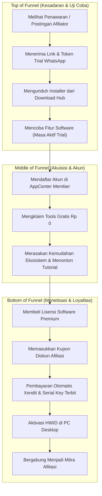

# DOKUMENTASI NON-TEKNIS & STRATEGI BISNIS APPCENTER V2
## Analisis Model Bisnis, User Persona, Psikologi UI/UX, & Panduan Operasional

**Versi**: 2.0.0 (Production Release)  
**Target Pembaca**: Product Managers, Business Strategists, Customer Support, Marketing Team, Administrator  

---

## DAFTAR ISI
1. [Model Bisnis & Value Proposition](#1-model-bisnis--value-proposition)
2. [User Persona & Customer Journey Funnels](#2-user-persona--customer-journey-funnels)
3. [Analisis Non-Teknis Per Fitur Sistem](#3-analisis-non-teknis-per-fitur-sistem)
   - 3.1 Portal Member & Akuisisi Pengguna
   - 3.2 Katalog Software, Pricing Strategy, & Produk Gratis Rp 0
   - 3.3 Sistem Lisensi & HWID Protection Exclusivity
   - 3.4 Program Afiliasi & Skema Kemitraan Reseller
   - 3.5 Generator Trial & Closing Sales via WhatsApp
   - 3.6 Pusat Pembelajaran Video & Download Hub
   - 3.7 Konsol Pengelolaan & Keamanan Admin
4. [Psikologi Antarmuka (UI/UX) & Interaksi Visual](#4-psikologi-antarmuka-uiux--interaksi-visual)
5. [Standard Operating Procedures (SOP) Operasional](#5-standard-operating-procedures-sop-operasional)
   - SOP 1: Rilis & Update Perangkat Lunak Baru
   - SOP 2: Penanganan Komplain Lisensi & Migrasi Mesin Pengguna
   - SOP 3: Verifikasi & Pencairan Komisi Afiliasi (Weekly Payout)
   - SOP 4: Prosedur Pemeliharaan & Pencadangan Basis Data Berkala

---

## 1. MODEL BISNIS & VALUE PROPOSITION

### 1.1 Model Bisnis
AppCenter V2 beroperasi dengan model **Direct-to-Consumer (D2C) & Reseller-Driven Digital Software Hub**:
1. **Penjualan Lisensi Perangkat Lunak Desktop**: Pengguna membeli lisensi software otomatisasi dengan berbagai model durasi (Bulanan, Tahunan, Lisensi Penuh).
2. **Freemium & Lead Generation (Rp 0 Products)**: Alat bantu gratis disediakan untuk menurunkan friksi registrasi dan membangun basis data pengguna terdaftar yang terverifikasi.
3. **Affiliate Commission Revenue Sharing**: Jaringan reseller/marketer mempromosikan software menggunakan kode kupon unik dengan bagi hasil komisi otomatis per transaksi sukses.

### 1.2 Value Proposition
- **Kepada End-User (Pembeli)**: Transaksi cepat via gateway otomatis (QRIS, VA, E-Wallet), aktivasi lisensi mandiri 24/7 tanpa perlu konfirmasi manual developer, tersedianya panduan video terstruktur, dan fitur migrasi PC mandiri jika pengguna mengganti perangkat.
- **Kepada Mitra Afiliasi**: Transparansi komisi per pesanan, kemudahan berbagi kupon promosi yang memberikan diskon nyata kepada audiens, dan pencairan dana ke rekening bank lokal maupun dompet digital.
- **Kepada Pengelola Bisnis**: Pengendalian terpusat seluruh inventaris produk, token lisensi, pencegahan pembajakan software via single-device lock, serta keamanan database yang terlindungi.

---

## 2. USER PERSONA & CUSTOMER JOURNEY FUNNELS

### 2.1 Persona Pengguna
1. **Budi (Digital Marketer / Buyer)**:
   - Membutuhkan software desktop untuk mempercepat pekerjaan harian.
   - Menginginkan proses aktivasi cepat: beli -> dapat key -> paste di software -> langsung jalan.
2. **Rian (Affiliate Marketer / Reseller)**:
   - Memiliki audiens di komunitas telegram/media sosial.
   - Ingin membagikan diskon khusus dengan kupon miliknya dan mendapatkan komisi pasif yang cair tepat waktu setiap minggu.
3. **Fiko (Super Administrator / Business Owner)**:
   - Mengelola operasional sistem, memantau omset, mengunggah pembaruan software, membuat token trial untuk prospek, dan menjaga kestabilan data platform.

### 2.2 Customer Journey Funnel

---

## 3. ANALISIS NON-TEKNIS PER FITUR SISTEM

### 3.1 Portal Member & Akuisisi Pengguna
- **Mengapa Email Dikunci Permanen?**
  - Email adalah identitas kepemilikan lisensi. Jika email dapat diubah bebas, potensi sengketa akun, penjualan akun ilegal, dan ketidaksinkronan data pembayaran dengan Xendit dapat terjadi.
- **Desain Formulir Registrasi Rendah Hambatan**:
  - Kolom esensial: Nama, Email, WhatsApp, Kata Sandi.
  - Akun langsung aktif seketika tanpa verifikasi email berbelit-belit agar pengguna dapat segera mencoba software.

### 3.2 Katalog Software, Pricing Strategy, & Produk Gratis Rp 0
- **Psikologi Harga Rp 0**:
  - Pengguna merasa mendapatkan *reward* instan setelah mendaftar.
  - Tombol "Klaim Gratis" membangun kebiasaan checkout di platform.
- **Transparansi Diskon & Kupon**:
  - Menampilkan coretan harga asli dan badge persentase hemat untuk memicu urgensi pembelian.

### 3.3 Sistem Lisensi & HWID Protection Exclusivity
- **Mengapa Single-Device HWID Lock?**
  - Mencegah 1 lisensi disebarluaskan dan dipakai secara bersamaan oleh puluhan orang (piracy protection).
- **Fleksibilitas Migrasi PC Mandiri**:
  - Pengguna tidak merasa terkunci selamanya jika laptop rusak atau ganti PC baru. Pengguna cukup memasukkan kembali lisensinya di komputer baru untuk memindahkan hak akses secara mandiri.

### 3.4 Program Afiliasi & Skema Kemitraan Reseller
- **Win-Win Mutual Attraction**:
  - Pembeli senang karena mendapat diskon harga via kupon.
  - Afiliator senang karena mendapat komisi pasti yang tercatat real-time.
  - Developer senang karena akuisisi pengguna baru didorong secara organik oleh komunitas.

### 3.5 Generator Trial & Closing Sales via WhatsApp
- **Psikologi Template Chat Ramah & Formal**:
  - Menyapa dengan ramah (*"Halo kak! 👋"*), memberikan panduan langkah demi langkah 1-2-3 yang mudah dipahami orang awam.
  - Memberikan batas waktu kedaluwarsa yang tegas (format tanggal & jam WIB) untuk menciptakan batas evaluasi yang jelas.

### 3.6 Pusat Pembelajaran Video & Download Hub
- **Tutorial Video Cinema Modal**:
  - Mengurangi beban Customer Support hingga 80% karena pengguna dapat menonton panduan penggunaan langsung di dalam website tanpa meninggalkan dashboard.
- **Pusat Unduhan Multi-OS**:
  - Menghilangkan kebingungan pengguna mengenai installer mana yang harus diunduh (Windows `.exe` vs macOS `.dmg`).

### 3.7 Konsol Pengelolaan & Keamanan Admin
- **Keamanan PIN 6-Digit & Rate Limiting**:
  - Sangat cepat diinput oleh admin di smartphone maupun desktop, namun kebal dari serangan brute-force otomatis berkat sistem eskalasi lockout (3m -> 5m -> 10m -> 15m).
- **Pengaturan & Backup Database Mandiri**:
  - Memberikan rasa aman bagi pemilik bisnis bahwa seluruh aset data, lisensi pelanggan, dan riwayat finansial dapat dicadangkan kapan saja dalam format SQL murni yang 100% aman.

---

## 4. PSIKOLOGI ANTARMUKA (UI/UX) & INTERAKSI VISUAL

1. **Dual Theme (Dark Mode & Light Mode)**:
   - Mode Gelap (`#070c16`) memberikan kesan modern, futuristik, dan eksklusif untuk kalangan tech-savvy/marketer.
   - Mode Terang (`#f8fafc`) memberikan keterbacaan tajam dengan kontras tinggi untuk kenyamanan kerja siang hari.
2. **Motion Design (Sliding Pills)**:
   - Elemen penanda navigasi meluncur mulus mengikuti kursor pengguna, memberikan impresi aplikasi native yang responsif dan berkelas.
3. **Hierarki Tombol Aksi**:
   - Aksi primer (Klaim, Bayar, Simpan) menggunakan aksen biru/emerald vibran.
   - Aksi destruktif (Hapus, Banned) menggunakan aksen rose/merah dengan modal konfirmasi wajib.
4. **Estetika Anti-AI-Slop & Apple TV-Class Frosted Glass Landing Page**:
   - Bar navigasi publik menggunakan material *translucent glass* khas Apple TV (`backdrop-blur-2xl bg-[#0a0f1d]/80`) yang melayang transparan di atas konten.
   - Mengeliminasi total elemen dot pendar animasi generik (*AI-slop pinging dots*) dan karakter emoji untuk menghadirkan citra platform perangkat lunak kelas profesional (*enterprise-grade software hub*).
   - Tombol registrasi dan akses portal menggunakan aksen *Apple Rounded Pill* dengan gradien Royal Blue (`#2563eb`) yang selaras 100% dengan antarmuka Member Area dan Admin Panel.

---

## 5. STANDARD OPERATING PROCEDURES (SOP) OPERASIONAL

### SOP 1: Rilis & Update Perangkat Lunak Baru
1. Developer mengompilasi file binary desktop (`.exe` atau `.dmg`).
2. Masuk ke Admin Panel `#/admin/products`.
3. Pilih produk terkait, buka tab **Kelola Installer**.
4. Unggah file installer baru melalui multi-chunk SFTP uploader.
5. Verifikasi bahwa URL unduhan di `download.ziqva.com` dapat diakses dan ukuran berkas sesuai.

### SOP 2: Penanganan Komplain Lisensi & Migrasi Mesin Pengguna
1. Pengguna menghubungi admin karena lisensi tidak bisa diaktifkan di PC baru.
2. Buka Admin Panel `#/admin/users` atau `#/admin/payments`.
3. Cari akun pengguna berdasarkan email.
4. Cek status lisensi di `token_device_activation` dan riwayat binding di `device`.
5. Arahkan pengguna untuk memasukkan token lisensi yang sama langsung di software PC baru (sistem otomatis melakukan transfer HWID).

### SOP 3: Verifikasi & Pencairan Komisi Afiliasi (Weekly Payout)
1. Setiap periode payout (misal Senin pagi), admin membuka `#/admin/affiliate`.
2. Pilih tab `Perlu Dicairkan` atau filter bank tujuan.
3. Lakukan transfer dana manual ke rekening bank / e-wallet mitra sesuai nomor rekening yang tertera.
4. Klik tombol **Tandai Ditransfer**, masukkan catatan transfer (misal nomor referensi bank), lalu konfirmasi.
5. Transaksi otomatis berpindah ke `#/admin/affiliate/history`.

### SOP 4: Prosedur Pemeliharaan & Pencadangan Basis Data Berkala
1. Buka `#/admin/settings`.
2. Klik tombol **Mulai Cadangkan Database**.
3. Pantau indikator progress live hingga mencapai 100% (Status: Selesai).
4. Unduh berkas `.sql` cadangan ke penyimpanan lokal terenkripsi.
5. Pastikan riwayat pengunduhan tercatat di audit log.
