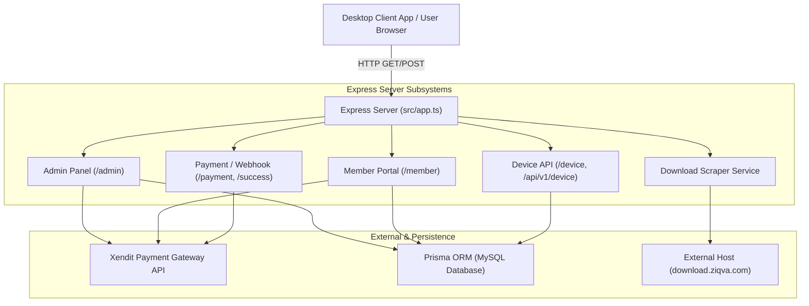
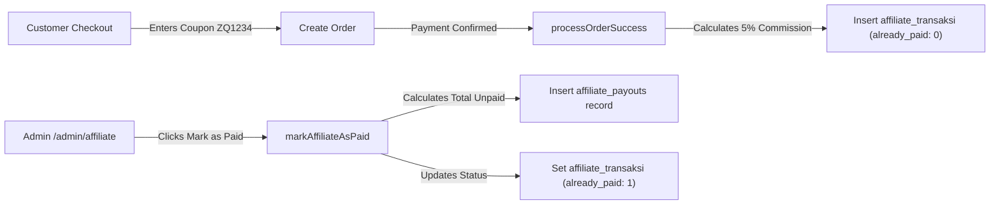

# AppCenter V2 — Complete System Feature Matrix & Architecture Document

This document is the consolidated single source of truth for all subsystems, routes, endpoints, UI views, services, database schemas, and business logic in **AppCenter V2 (Ziqva Store)**.

---

## Table of Contents
1. [Executive Summary & System Architecture](#1-executive-summary--system-architecture)
2. [Subsystem 1: Member Portal](#2-subsystem-1-member-portal)
3. [Subsystem 2: Admin Panel & Management](#3-subsystem-2-admin-panel--management)
4. [Subsystem 3: Affiliate & Payout Engine](#4-subsystem-3-affiliate--payout-engine)
5. [Subsystem 4: Payment Gateway & Xendit Integration](#5-subsystem-4-payment-gateway--xendit-integration)
6. [Subsystem 5: Device API, Licensing & Download Center](#6-subsystem-5-device-api-licensing--download-center)
7. [Comprehensive Endpoint & Route Reference](#7-comprehensive-endpoint--route-reference)
8. [Database Models & Relationship Schema](#8-database-models--relationship-schema)

---

## 1. Executive Summary & System Architecture

**AppCenter V2 (Ziqva Store)** is a Node.js + Express.js + TypeScript application with a server-side rendered (SSR) frontend using modular HTML templates and Tailwind CSS styling. Persistence is managed via Prisma ORM connected to MySQL (`ziqva_labs`).



### Core Technologies
- **Backend Core**: Express 5.2.1, TypeScript 5.9.3, Node.js.
- **ORM & Database**: Prisma ORM 6.19.2 -> MySQL (`ziqva_labs`).
- **Session Layer**: `express-session` with `express-mysql-session` store.
- **Payment Gateway**: Xendit REST API v2/v3 (Hosted Invoices & Webhooks).
- **Security & Headers**: Helmet (CSP disabled for inline admin scripts), CORS, Morgan logger.

---

## 2. Subsystem 1: Member Portal

The Member Portal allows end users to manage their accounts, order software subscriptions, view active license keys, rebind machine IDs, participate in the affiliate program, and download software installers.

### Auth & Session Lifecycle
- **Session Model**: Stores `userId`, `userName`, `userEmail`, `userAvatar`, and boolean flag `isMemberAuthenticated`.
- **Registration**: Auto-sets `verified: true`, `banned: false`, creates account with plaintext password.
- **Login Guard**: Checks user exists, password matches, `verified === true`, `banned === false`.

### Key Member Views
- `memberLoginPage`: Login form with jQuery submit state toggle.
- `memberRegisterPage`: Registration form with client-side password matching.
- `memberDashboardPage`: Overview statistics (Account status, Total orders) & welcome banner.
- `memberOrdersPage`: Paginated order list with search, status badges, and action buttons.
- `memberCreateOrderPage`: Interactive checkout calculator (select product, 2/4/6 months duration, voucher validation, total summary).
- `memberLicensesPage`: License table listing product name, 20-char license key (copy-to-clipboard), status badge, machine ID, validity time, and machine ID edit action.
- `memberDeviceEditPage`: Input form to rebind license to a new Hardware Machine ID (`machine_id`).
- `memberProfilePage`: Profile details & password change form.

---

## 3. Subsystem 2: Admin Panel & Management

The Admin Panel provides administrative management for sales overview, manual payment links, trial token generation, affiliate payout approvals, and order duration modifications.

### Admin Auth & Security
- **Authentication**: 6-digit numeric PIN verified against `prisma.admin`.
- **Session Security**: Admin session stored in `app_admin_session` / `express-mysql-session` with 3-day max age.
- **`adminAuth` Middleware**: Protects all `/admin/*` routes (except `/admin/login` and `/admin/webhook`).

### Key Admin Features
1. **Executive Dashboard (`/admin/dashboard`)**:
   - Monthly Net Revenue (Gross sales minus affiliate commission costs).
   - Total Orders count with pending badge.
   - Active Affiliates headcount & Total Unpaid Commissions.
   - Interactive Chart.js 7-day revenue trend bar chart.
   - Top 5 best-selling products breakdown.
2. **Manual Payment Generator (`/admin/payment/create`)**:
   - Admin creates custom orders specifying customer email/name, product, duration (1, 3, 6, 12 months), and optional notes.
   - Real-time client JavaScript total calculator including admin fee percentage.
   - Generates Xendit hosted invoice link immediately.
3. **Payments Table (`/admin/payments`)**:
   - Order list with search filter (Order ID, Email, Product, License Key).
   - Status badge toggles (`SUCCESS` / `PENDING`).
   - Actions: Manual Payment Confirmation (`confirmPaymentManually`) and Order Duration Update (`updateOrderDuration`).
4. **Trial Token Generator (`/admin/trials/create`)**:
   - Generates trial codes with format `TRIAL-XXXXXXXXXXXXXXXX` (22 chars).
   - Allows setting duration in hours, days, or months.
   - Inserts into `prisma.trial` with initial user state `'WAITING_ACTIVATION'`.

---

## 4. Subsystem 3: Affiliate & Payout Engine

The Affiliate Engine tracks referral commissions, manages custom coupon codes, and executes batch commission payouts for eligible affiliators.



### Business Rules & Formulas
- **Enrollment Rule**: User must have at least **6 completed orders in the last 180 days** to join the affiliate program.
- **Default Settings**: Coupon prefix `ZQ` + 4 random chars, `kupon_decrease_value = 10` (10% buyer discount), `kupon_income_idr = 5` (5% affiliator commission).
- **Custom Coupon Rule**: Must be uppercase alphanumeric (`^[A-Z0-9]+$`), 3–20 chars, and unique across both `voucers` and `affiliate_member` tables.
- **Commission Trigger**: Recorded into `affiliate_transaksi` **only after payment is complete** (`status === 'Order has been complete'`).
- **Payout Process**: Admin clicks "Mark as Paid" on `/admin/affiliate` -> sums unpaid income -> creates `affiliate_payouts` entry -> bulk updates `affiliate_transaksi.already_paid = 1` and `paid_at = now`.

---

## 5. Subsystem 4: Payment Gateway & Xendit Integration

Integrates Xendit API for multi-channel checkout (Virtual Accounts, QRIS, E-Wallets) and automated webhook status callbacks.

### Xendit Integration Life Cycle
1. **Invoice Creation (`XenditService.createInvoice`)**:
   - Calls Xendit `POST /v2/invoices` with `externalId: order_{id}_{timestamp}` and total IDR amount.
   - Updates `order_list` with `payment_request_id` (Invoice ID) and `payment_url`.
2. **Webhook Endpoint (`POST /payment/success`)**:
   - Validates `x-callback-token` header against `XENDIT_WEBHOOK_TOKEN`.
   - Handles `invoice.paid`, `payment.capture`, and direct payload patterns.
3. **Idempotent Fulfillment (`processOrderSuccess`)**:
   - Verifies order status is not already completed (`status !== 'Order has been complete'`).
   - Sets `order_list.status = 'Order has been complete'`, `paid_at = timestamp`.
   - Generates 20-character license token in `token_device_activation`.
   - Inserts referral record in `affiliate_transaksi` if affiliate voucher was attached.

---

## 6. Subsystem 5: Device API, Licensing & Download Center

Serves client desktop applications for device registration, status verification, license activation, and software download link distribution.

### Device Endpoints & Logic
- **`POST /device/status` (or `/api/v1/device/status`)**:
  - Arguments passed via query params: `product`, `machine_id`.
  - Checks active `device` record first. If found, returns `registered = true`, user name/email, and Indonesian formatted string dates (e.g. `"7 Agustus 2026"`).
  - If not found in `device`, checks `trial` record. If found, returns trial user info and label `TRIAL-xxxxx`.
  - Returns legacy wrapper structure: `{ tobelsoft: { status: 200, data: { ... } } }`.
- **`POST /device/activation` (or `/api/v1/device/activation`)**:
  - Arguments: `token`, `product`, `machine_id`.
  - **Paid License Token (`token_device_activation`)**: If active device already exists for this order/email, **transfers license** by updating `device.machine_id = machineId`. If new device, calculates `expiredDate = now + (duration_minutes * 60)` and inserts new `device` record.
  - **Trial License Token (`trial`)**: **Strict Single Machine Lock**. If `trial.machine_id` is already set, activation fails with `"Kode trial tidak bisa diaktifkan 2x"`. Otherwise binds `trial.machine_id = machineId`.

### Download Service & Scraper
- **Target**: Scrapes `http://download.ziqva.com`.
- **Parsing Logic**: Parses HTML title for root path, extracts file links (`.exe`, `.dmg`, `.zip`), calculates human-readable sizes (`B`, `KB`, `MB`, `GB`), and generates direct HTTPS download links (`https://download.ziqva.com/path/filename`).
- **UI Surfaces**: Accessible publicly at `GET /download` and for authenticated members at `GET /member/downloads`.

---

## 7. Comprehensive Endpoint & Route Reference

| HTTP Method | Path Pattern | Protection / Middleware | Controller / Handler | Purpose |
|---|---|---|---|---|
| `GET` | `/health` | Public | Inline handler | Returns server health & uptime |
| `GET` | `/robots.txt` | Public | Inline handler | Disallows search indexing for admin/member |
| `GET` | `/download` | Public | `PublicController.showDownloads` | Renders public software download center |
| `GET` | `/` | Public | Inline redirect | Redirects to `/member/login` |
| `GET` | `/member/login` | Public | `MemberController.showLogin` | Renders member login page |
| `POST` | `/member/login` | Public | `MemberController.processLogin` | Member authentication |
| `GET` | `/member/register` | Public | `MemberController.showRegister` | Renders registration page |
| `POST` | `/member/register` | Public | `MemberController.processRegister` | Account creation |
| `GET` | `/member/dashboard` | Member Session | `MemberController.showDashboard` | Member dashboard |
| `GET` | `/member/downloads` | Member Session | `MemberController.showDownloads` | Member download page |
| `GET` | `/member/orders` | Member Session | `MemberController.showOrders` | Member order list |
| `GET` | `/member/orders/create` | Member Session | `MemberController.showCreateOrder` | Order creation form |
| `POST` | `/member/orders/create` | Member Session | `MemberController.processCreateOrder` | Submits new order |
| `POST` | `/member/api/check-voucher` | Member Session | `MemberController.apiCheckVoucher` | AJAX voucher validation |
| `GET` | `/member/orders/:orderId/pay` | Member Session | `MemberController.payOrder` | Order checkout redirect |
| `GET` | `/member/licenses` | Member Session | `MemberController.showLicenses` | View user license keys |
| `GET` | `/member/device/:deviceId/edit-machine` | Member Session | `MemberController.showEditMachine` | Edit machine ID page |
| `POST` | `/member/device/:deviceId/edit-machine` | Member Session | `MemberController.processEditMachine` | Updates device machine ID |
| `GET` | `/member/affiliate` | Member Session | `MemberController.showAffiliate` | Affiliate dashboard |
| `POST` | `/member/affiliate/join` | Member Session | `MemberController.processJoinAffiliate` | Enroll in affiliate program |
| `GET` | `/member/affiliate/payouts` | Member Session | `MemberController.showPayoutHistory` | Member payout history |
| `POST` | `/member/affiliate/update-payout` | Member Session | `MemberController.updateAffiliateProfile` | Updates bank account info |
| `POST` | `/member/affiliate/update-coupon` | Member Session | `MemberController.updateAffiliateCoupon` | Updates custom coupon code |
| `GET` | `/member/profile` | Member Session | `MemberController.showProfile` | Member profile page |
| `POST` | `/member/change-password` | Member Session | `MemberController.processChangePassword` | Password update action |
| `GET` | `/member/logout` | Member Session | `MemberController.logout` | Member logout |
| `GET` | `/admin/login` | Public | `AdminController.showLogin` | Admin login page |
| `POST` | `/admin/login` | Public | `AdminController.processLogin` | Admin PIN validation |
| `GET` | `/admin/dashboard` | Admin Auth | `AdminController.showDashboard` | Admin metrics & revenue chart |
| `GET` | `/admin/payments` | Admin Auth | `AdminController.showPaymentsList` | Order & payment list |
| `POST` | `/admin/payments/confirm/:id` | Admin Auth | `AdminController.confirmPaymentManually` | Manual payment approval |
| `POST` | `/admin/payments/update-duration/:id` | Admin Auth | `AdminController.updateOrderDuration` | Adjusts order duration |
| `GET` | `/admin/payment/create` | Admin Auth | `AdminController.showCreatePayment` | Manual payment request form |
| `POST` | `/admin/payment/create` | Admin Auth | `AdminController.processCreatePayment` | Generates Xendit payment link |
| `GET` | `/admin/payment/success` | Admin Auth | `AdminController.showPaymentSuccess` | Payment creation result page |
| `GET` | `/admin/trials/create` | Admin Auth | `AdminController.showCreateTrial` | Trial token generator form |
| `POST` | `/admin/trials/create` | Admin Auth | `AdminController.processCreateTrial` | Generates trial token |
| `GET` | `/admin/affiliate` | Admin Auth | `AdminController.showAffiliateManagement` | Admin affiliate management |
| `GET` | `/admin/affiliate/history` | Admin Auth | `AdminController.showPayoutHistory` | Admin payout history |
| `POST` | `/admin/affiliate/mark-paid` | Admin Auth | `AdminController.markAffiliateAsPaid` | Processes bulk affiliate payout |
| `GET` | `/admin/logout` | Admin Auth | `AdminController.logout` | Admin logout |
| `POST` | `/payment/success` | Webhook Token | `AdminController.handleWebhook` | Xendit webhook callback |
| `GET` | `/payment/success` | Public | `AdminController.showPublicPaymentSuccess` | Payment return landing page |
| `POST` | `/device/status` | Public Query | `DeviceController.checkDeviceStatus` | Device status check endpoint |
| `POST` | `/device/activation` | Public Query | `DeviceController.activateLicense` | Device license activation |
| `GET` | `/api/v1/products` | Public | `ProductController.getProducts` | Returns product list JSON |
| `GET` | `/api/v1/products/:id` | Public | `ProductController.getProductById` | Returns single product JSON |

---

## 8. Database Models & Relationship Schema

### Core Prisma Models (`prisma/schema.prisma`)

```prisma
model admin {
  id       Int     @id @default(autoincrement())
  username String  @db.LongText
  password String  @db.LongText
  up_link  String  @db.LongText
  ip       String  @db.LongText
  role     String? @db.VarChar(100)
  pin      String? @db.VarChar(10)
}

model user {
  id        Int      @id @default(autoincrement())
  email     String   @db.VarChar(255)
  password  String   @db.VarChar(255)
  name      String?  @db.VarChar(255)
  company   String?  @db.VarChar(255)
  whatsapp  String?  @db.VarChar(50)
  verified  Boolean  @default(true)
  banned    Boolean  @default(false)
  created   Int
  avatar    String?  @db.Text
}

model order_list {
  id                 Int      @id @default(autoincrement())
  items              String   @db.Text
  created            Int
  confirmed_by       String   @db.VarChar(255)
  status             String   @db.VarChar(255)
  payment            String   @db.VarChar(255)
  duration           Int
  user               String   @db.VarChar(255)
  voucer             String?  @db.Text
  total_amount       Int?
  admin_fee          Int?     @default(0)
  payment_request_id String?  @db.VarChar(255)
  payment_id         String?  @db.VarChar(255)
  payment_url        String?  @db.Text
  paid_at            Int?
  payment_expires_at Int?
  status_badge       String?  @db.VarChar(50)
  last_updated       String?  @db.VarChar(100)
}

model token_device_activation {
  id         Int     @id @default(autoincrement())
  token      String  @db.VarChar(255)
  duration   Int     // Duration in minutes
  product    String  @db.VarChar(255)
  taked      Boolean @default(false)
  taked_at   Int?
  taked_ip   String? @db.VarChar(255)
  user       String  @db.VarChar(255)
  order_id   Int?
}

model device {
  id         Int    @id @default(autoincrement())
  order_id   Int
  email      String @db.LongText
  expired    Int    // Expiry epoch timestamp in seconds
  product    String @db.LongText
  machine_id String @db.LongText
  created    Int
  duration   Int
  label      String @db.VarChar(255)
}

model trial {
  id         Int     @id @default(autoincrement())
  token      String  @db.VarChar(255)
  product    String  @db.VarChar(255)
  expired    Int     // Expiry epoch timestamp in seconds
  created    Int
  machine_id String? @db.VarChar(255)
  user       String  @db.VarChar(255)
}

model affiliate_member {
  id                   Int     @id @default(autoincrement())
  created              Int
  email                String  @db.VarChar(255)
  unix                 String  @db.VarChar(255)
  kupon                String? @db.VarChar(255)
  kupon_decrease_value Int
  kupon_income_idr     Int
  payout_bank_name     String? @db.VarChar(255)
  payout_no_rek        String? @db.VarChar(255)
  payout_name          String? @db.VarChar(255)
}

model affiliate_transaksi {
  id                  Int    @id @default(autoincrement())
  product_name        String @db.VarChar(255)
  created_at          Int
  affiliate_income    Int
  tanggal             Int
  bulan               Int
  tahun               Int
  invoice_code        String @db.VarChar(255)
  already_paid        Int
  paid_at             Int?
  affiliator_email    String @db.VarChar(255)
  customer_email      String @db.VarChar(255)
  customer_name       String @db.VarChar(255)
  customer_paid_price Int
}

model affiliate_payouts {
  id              Int    @id @default(autoincrement())
  created         Int
  affiliate_email String @db.VarChar(255)
  accepted_by     String @db.VarChar(255)
  note            String @db.VarChar(255)
  amount          Int
}

model products {
  id               Int      @id @default(autoincrement())
  product_name     String   @db.VarChar(255)
  price            Int
  is_discount      Boolean  @default(false)
  discount_percent Int?     @default(0)
  description      String?  @db.Text
  download_url     String?  @db.Text
  created_at       Int
}

model voucers {
  id             Int     @id @default(autoincrement())
  code           String  @db.VarChar(100)
  decrease_value Int
  voucer_type    String  @db.VarChar(50)
  product        String? @db.VarChar(255)
  expired        Int
  is_active      Boolean @default(true)
}
```
