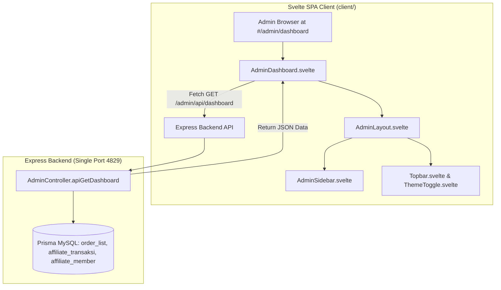

# Admin Dashboard Svelte Migration Implementation Plan

> **For agentic workers:** REQUIRED SUB-SKILL: Use superpowers:subagent-driven-development to implement this plan task-by-task. Steps use checkbox (`- [ ]`) syntax for tracking.

**Goal:** Migrasi halaman Dashboard Admin dari template SSR legacy (`src/views/dashboard.ts`) ke komponen Single Page Application (SPA) berbasis **Svelte** (`client/src/lib/pages/AdminDashboard.svelte`) dengan tata letak, komponen tema, dan style yang sama persis dengan Member Area (`AdminLayout.svelte`, `AdminSidebar.svelte`, `Topbar.svelte`), serta bebas dari elemen klise AI-slop.

**Architecture:** Backend Express (`AdminController.showDashboard` & `AdminController.apiGetDashboard`) menyediakan data agregasi analitik (Pendapatan Net/Gross, Pesanan, Affiliasi, Komisi Pending, Top 5 Produk, Grafik 7 Hari, dan 5 Transaksi Terakhir) dalam format JSON melalui endpoint `GET /admin/api/dashboard`. Komponen Svelte `AdminDashboard.svelte` dibungkus oleh `AdminLayout.svelte` (berisi `AdminSidebar.svelte` dan `Topbar.svelte`), mengonsumsi data via AJAX, merender kartu analitik modern, visual bar chart 7 hari yang responsif, dan tabel transaksi terkini dengan dukungan mode Gelap/Terang.

**Architecture Diagram:**

**Tech Stack:** Svelte 4, Vite 5, TypeScript 5.9, Express.js 5, Prisma ORM, Tailwind CSS / Custom Theme Tokens (`appcenter-theme.css`).

## Global Constraints

- **Single Port Invariant**: Express backend dan Svelte client bundle harus berjalan pada single-port `4829`.
- **Branch Invariant**: Seluruh commit dan push wajib ditujukan ke branch `reborn`. Jangan push ke `master`.
- **Anti-AI Slop**: Tanpa gradasi pelangi/ungu-pink, tanpa badge biscuit pulsing dot, tanpa shadow neon. Menggunakan palet warna solid, tipografi tajam, dan variabel CSS sistem (`var(--page)`, `var(--surface)`, `var(--border)`, `var(--text)`).
- **Style Consistency**: Layout, sidebar, topbar, cards, spacing, dan font harus 100% konsisten dengan Member Area.

---

### Task 1: Backend Admin Dashboard JSON API Endpoint

**Files:**
- Modify: `src/controllers/adminController.ts`
- Modify: `src/routes/adminRoutes.ts`

**Interfaces:**
- Consumes: `req.session.isAuthenticated` (admin session)
- Produces: `GET /admin/api/dashboard` -> JSON `{ status: 'success', data: { adminName, stats: {...}, topProducts: [...], revenueGraphData: [...], recentOrders: [...] } }`
- Modifies: `GET /admin/dashboard` -> Redirects browser `text/html` requests to `/#/admin/dashboard`.

- [ ] **Step 1: Implement `apiGetDashboard` in `src/controllers/adminController.ts`**
Extract dashboard calculation logic into a reusable method and return JSON response. Update `showDashboard` to redirect browser navigation to `/#/admin/dashboard`.

- [ ] **Step 2: Register `GET /admin/api/dashboard` in `src/routes/adminRoutes.ts`**

- [ ] **Step 3: Run TypeScript typecheck**
Run: `npx tsc --noEmit`  
Expected: 0 errors.

---

### Task 2: Build Reusable Admin Navigation Shell (`AdminSidebar.svelte` & `AdminLayout.svelte`)

**Files:**
- Create: `client/src/lib/components/AdminSidebar.svelte`
- Create: `client/src/lib/components/AdminLayout.svelte`

**Interfaces:**
- Consumes: `activePage: string`, admin session from `GET /admin/api/session` or prop.
- Produces: Shared layout wrapper matching Member Area's layout (`Layout.svelte` & `Sidebar.svelte`), with admin menu items (Dashboard, Daftar Pembayaran, Buat Trial, Katalog Produk, Affiliate Management) and Logout action.

- [ ] **Step 1: Create `client/src/lib/components/AdminSidebar.svelte`**
- [ ] **Step 2: Create `client/src/lib/components/AdminLayout.svelte`**
- [ ] **Step 3: Test client compilation**
Run: `cd client && npm run build`  
Expected: 0 errors.

---

### Task 3: Build Svelte Admin Dashboard Page (`AdminDashboard.svelte`)

**Files:**
- Create: `client/src/lib/pages/AdminDashboard.svelte`

**Interfaces:**
- Consumes: `GET /admin/api/dashboard`
- Produces:
  1. Header banner with greeting, admin badge, and quick action buttons.
  2. 4 Stat Cards matching member styling:
     - Pendapatan Bersih (Net Revenue) with Gross & Affiliate deduction.
     - Total Pesanan (Total Orders & Pending count).
     - Affiliator Baru (New affiliates & Active count).
     - Komisi Pending (Unpaid commission amount).
  3. 7-Day Revenue Trend Bar Chart (Clean SVG / responsive CSS bars using theme colors).
  4. Top 5 Best Selling Products leaderboard.
  5. Recent Paid Orders table with order ID, customer email, amount, payment channel, and date.
  6. Skeleton loading state and error retry handler.

- [ ] **Step 1: Create `client/src/lib/pages/AdminDashboard.svelte`**
- [ ] **Step 2: Verify Svelte build**
Run: `cd client && npm run build`  
Expected: 0 errors.

---

### Task 4: Router Registration & SPA Fallback

**Files:**
- Modify: `client/src/App.svelte`

**Interfaces:**
- Produces: Router mapping for `/admin/dashboard` pointing to `AdminDashboard.svelte`.

- [ ] **Step 1: Register route in `client/src/App.svelte`**
- [ ] **Step 2: Execute full project build**
Run: `npm run build`  
Expected: 0 errors.

---

### Task 5: Automated Verification & Screenshots

**Files:**
- Create: `scripts/verify-admin-dashboard.js`

**Interfaces:**
- Tests:
  1. API endpoint `GET /admin/api/dashboard` with PIN login `085213`.
  2. Headless Chrome browser test navigating to `http://localhost:4829/#/admin/dashboard`.
  3. Verifies stat cards, 7-day revenue chart, top products, and recent orders table in both Dark and Light themes.
  4. Saves screenshots to artifact directory.

- [ ] **Step 1: Create `scripts/verify-admin-dashboard.js`**
- [ ] **Step 2: Run verification script**
Run: `node scripts/verify-admin-dashboard.js`  
Expected: All tests pass and screenshots captured.

---

### Task 6: Documentation & Git Commit

**Files:**
- Modify: `docs/CONTEXT_SNAPSHOT.yaml`
- Modify: `ZIQVA_STORE_ANALYSIS.md`

- [ ] **Step 1: Update context snapshots with Admin Dashboard Svelte migration**
- [ ] **Step 2: Commit and push to `reborn` branch**
Run: `git add . && git commit -m "feat(admin): migrate admin dashboard to modern svelte spa with matching member layout"`
Run: `git push origin reborn`
