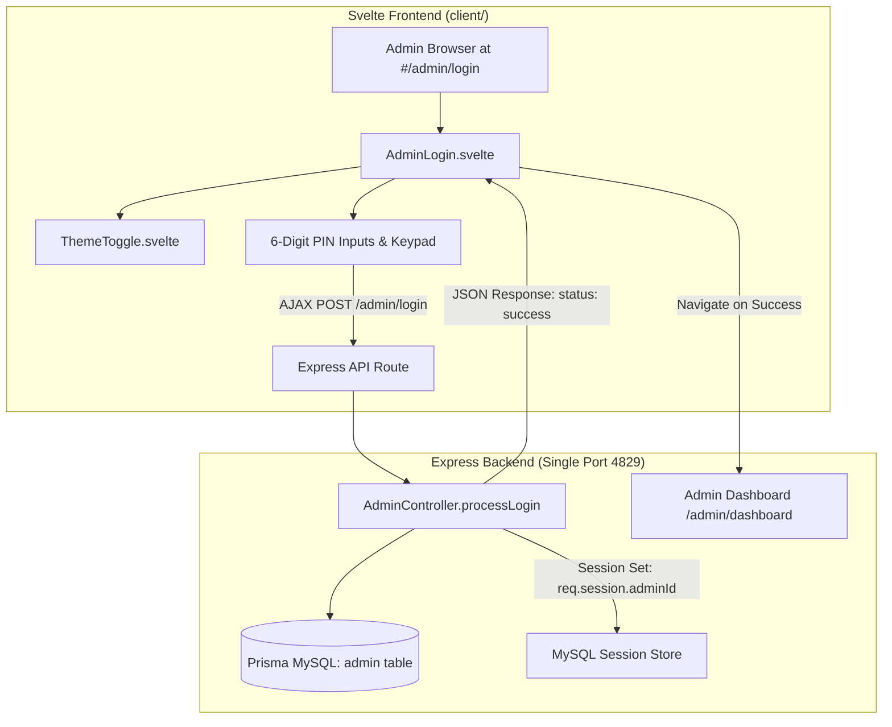

# Admin PIN Login Svelte Migration Implementation Plan

> **For agentic workers:** REQUIRED SUB-SKILL: Use superpowers:subagent-driven-development to implement this plan task-by-task. Steps use checkbox (`- [ ]`) syntax for tracking.

**Goal:** Migrasi halaman Login Admin PIN dari template SSR HTML legacy (`src/views/login.ts`) ke komponen Single Page Application (SPA) Svelte yang modern, responsif, dan elegan (`client/src/lib/pages/AdminLogin.svelte`) terintegrasi penuh dengan sistem tema (Dark/Light mode) serta Express backend API JSON pada port `4829`.

**Architecture:** Frontend Svelte menangani interaksi input 6-digit PIN (auto-advance, backspace navigation, paste handler, masked PIN, tactile numeric keypad) dan mengirimkan AJAX request ke `POST /admin/login` dengan header `Accept: application/json`. Backend Express (`AdminController.processLogin`) mengautentikasi PIN 6-digit terhadap tabel `admin` di Prisma MySQL, mengatur session admin (`req.session.isAuthenticated = true`), dan mengembalikan respon JSON terstruktur. Pada respon sukses, browser mengarahkan admin ke `/admin/dashboard`.

**Architecture Diagram:**



**Tech Stack:** Svelte 4, Vite 5, TypeScript 5.9, Express.js 5, Prisma ORM, Tailwind CSS / Custom Theme Tokens (`data-theme`).

## Global Constraints

- Single Port Invariant: Express backend dan Svelte client bundle harus berjalan pada single-port `4829`.
- Git Branch Invariant: Seluruh commit dan perubahan wajib berada di branch `reborn`. Jangan pernah melakukan push ke `master`.
- Security: PIN input harus tepat 6 digit numerik, dengan proteksi brute force rate/validation feedback yang aman dan session `isAuthenticated = true`.
- Zero Error Build: `npm run build` (yang menjalankan build client Vite + server TypeScript) harus lulus 100% dengan exit code 0.

---

### Task 1: Backend Admin Controller & Route JSON API Enhancement

**Files:**
- Modify: `src/controllers/adminController.ts`
- Modify: `src/routes/adminRoutes.ts`

**Interfaces:**
- Consumes: `req.body.pin: string`, Express Session (`req.session.adminId`, `req.session.adminName`, `req.session.isAuthenticated`).
- Produces: 
  - `POST /admin/login` -> JSON `{ status: 'success' | 'error', message: string, redirect?: string, admin?: { id: number, username: string } }`
  - `GET /admin/api/session` -> JSON `{ authenticated: boolean, admin?: { id: number, username: string } }`
  - `GET /admin/login` -> Seamless redirect to `/#/admin/login` for browser navigation or SPA fallback.

- [ ] **Step 1: Update `processLogin` in `src/controllers/adminController.ts` to support JSON request**

```typescript
    /**
     * Process login
     */
    async processLogin(req: Request, res: Response) {
        try {
            const isJson = req.is('json') || (req.headers.accept && req.headers.accept.includes('application/json'));
            const body = req.body as { pin?: string };
            const { pin } = body;

            if (!pin || pin.length !== 6 || !/^\d{6}$/.test(pin)) {
                if (isJson) return res.status(400).json({ status: 'error', message: 'PIN harus 6 digit angka' });
                return res.redirect('/admin/login?error=PIN harus 6 digit');
            }

            // Find admin with matching PIN
            const admin = await prisma.admin.findFirst({
                where: { pin: pin },
            });

            if (!admin) {
                if (isJson) return res.status(401).json({ status: 'error', message: 'PIN tidak valid' });
                return res.redirect('/admin/login?error=PIN tidak valid');
            }

            // Set session
            req.session.adminId = admin.id;
            req.session.adminName = admin.username;
            req.session.isAuthenticated = true;

            if (isJson) {
                return res.json({
                    status: 'success',
                    message: 'Login berhasil',
                    redirect: '/admin/dashboard',
                    admin: {
                        id: admin.id,
                        username: admin.username
                    }
                });
            }

            res.redirect('/admin/dashboard');
        } catch (error) {
            console.error('Login error:', error);
            const isJson = req.is('json') || (req.headers.accept && req.headers.accept.includes('application/json'));
            if (isJson) return res.status(500).json({ status: 'error', message: 'Terjadi kesalahan sistem' });
            res.redirect('/admin/login?error=Terjadi kesalahan sistem');
        }
    }
```

- [ ] **Step 2: Add `apiGetSession` and update `showLogin` in `src/controllers/adminController.ts`**

```typescript
    /**
     * Show login page (redirect to Svelte SPA or serve SSR fallback)
     */
    async showLogin(req: Request, res: Response) {
        if (req.session && req.session.isAuthenticated) {
            return res.redirect('/admin/dashboard');
        }

        // If client accepts HTML, redirect to SPA hash route
        if (req.headers.accept && req.headers.accept.includes('text/html')) {
            return res.redirect('/#/admin/login');
        }

        const error = req.query.error as string | undefined;
        res.send(loginPage(error));
        await Promise.resolve();
    }

    /**
     * Check Admin Session API
     */
    async apiGetSession(req: Request, res: Response) {
        try {
            if (req.session && req.session.isAuthenticated) {
                return res.json({
                    authenticated: true,
                    admin: {
                        id: req.session.adminId,
                        username: req.session.adminName
                    }
                });
            }
            return res.json({ authenticated: false });
        } catch (error) {
            console.error('Admin session check error:', error);
            return res.status(500).json({ authenticated: false, error: 'Session check failed' });
        }
    }
```

- [ ] **Step 3: Register `GET /admin/api/session` in `src/routes/adminRoutes.ts`**

```typescript
// Session check API
router.get('/api/session', (req, res) => adminController.apiGetSession(req, res));
```

- [ ] **Step 4: Verify TypeScript compilation for backend**

Run: `npx tsc --noEmit`  
Expected: 0 errors.

---

### Task 2: Build Svelte Admin Login Component (`AdminLogin.svelte`)

**Files:**
- Create: `client/src/lib/pages/AdminLogin.svelte`

**Interfaces:**
- Produces: Svelte SPA component with 6-digit PIN inputs, tactile keypad, masked mode, theme toggle, and AJAX authentication flow.

- [ ] **Step 1: Create `client/src/lib/pages/AdminLogin.svelte`**

Features to include:
1. Header with Brand Badge "Z", "Admin Security Portal", and ThemeToggle.
2. 6 Individual PIN input boxes with:
   - Dynamic binding to array of length 6.
   - Auto-advance to next input on digit entry.
   - Auto-jump back on Backspace.
   - Arrow keys Left/Right navigation.
   - Paste support: automatically distributes 6 digits into the boxes.
   - Show/hide PIN toggle (reveal dots vs numbers).
3. On-screen numeric keypad (0-9, Clear 'C', Backspace '⌫') for touch and rapid entry.
4. Auto-submit when 6 digits are filled.
5. Error alert with smooth shake animation and clear error message.
6. Loading spinner during submission.
7. Smooth redirection: `window.location.href = data.redirect || '/admin/dashboard'`.
8. Link to switch to Member Login (`#/member/login`).

- [ ] **Step 2: Verify Svelte syntax and TypeScript type checking in client**

Run: `cd client && npm run build`  
Expected: Svelte compiler passes with 0 errors.

---

### Task 3: Svelte App Router Registration (`App.svelte`)

**Files:**
- Modify: `client/src/App.svelte`

**Interfaces:**
- Consumes: `AdminLogin.svelte`
- Produces: Router mapping for `/admin/login` and `/admin`.

- [ ] **Step 1: Register route in `client/src/App.svelte`**

```typescript
    import AdminLogin from './lib/pages/AdminLogin.svelte';

    const routes = {
        '/': Dashboard,
        '/member': Dashboard,
        '/member/dashboard': Dashboard,
        '/member/tutorials': Tutorials,
        '/member/tutorials/:id': Tutorials,
        '/member/downloads': Downloads,
        '/member/orders': Orders,
        '/member/orders/create': ProductDetail,
        '/member/licenses': Licenses,
        '/member/profile': Profile,
        '/member/login': Login,
        '/member/register': Register,
        '/admin/login': AdminLogin,
        '/admin': AdminLogin,
        '*': Dashboard
    };
```

- [ ] **Step 2: Build full production bundle**

Run: `npm run build`  
Expected: Client bundle build + Server tsc compilation exit with code 0.

---

### Task 4: Automated Verification via Script & Browser Testing

**Files:**
- Create: `scripts/verify-admin-login.js`

**Interfaces:**
- Tests:
  1. `POST /admin/login` with incomplete PIN (e.g. 4 digits) -> 400 Bad Request.
  2. `POST /admin/login` with wrong PIN (e.g. `999999`) -> 401 Unauthorized.
  3. `GET /admin/api/session` -> `{ authenticated: false }`.
  4. Full browser headless test navigating to `http://localhost:4829/#/admin/login`, typing PIN, and confirming successful authentication.

- [ ] **Step 1: Create test script `scripts/verify-admin-login.js`**
- [ ] **Step 2: Run verification script**

Run: `node scripts/verify-admin-login.js`  
Expected: All tests pass and screenshot captured.

---

### Task 5: Documentation & Git Commit

**Files:**
- Modify: `docs/CONTEXT_SNAPSHOT.yaml`
- Modify: `ZIQVA_STORE_ANALYSIS.md`

- [ ] **Step 1: Update context snapshots with Admin Login Svelte migration status**
- [ ] **Step 2: Commit and push changes to `reborn` branch**

Run: `git add . && git commit -m "feat(admin): migrate admin pin login to modern svelte spa component"`
Run: `git push origin reborn`
