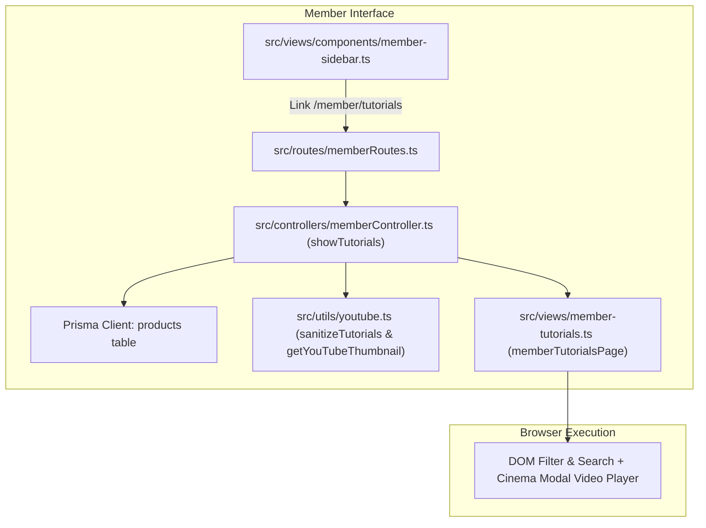

# Member Tutorials Menu & Video Learning Hub Implementation Plan

> **For agentic workers:** REQUIRED SUB-SKILL: Use superpowers:subagent-driven-development to implement this plan task-by-task. Steps use checkbox (`- [ ]`) syntax for tracking.

**Goal:** Menambahkan menu "Tutorial Video" di sidebar member (`/member/tutorials`) dan halaman Video Learning Hub terintegrasi dengan filter produk, search, serta Cinema Modal Player untuk memutar YouTube single video & playlist.

**Architecture:** Mengambil data produk aktif beserta kolom JSON `tutorials` via Prisma, mem-parsing dan memperkaya data dengan thumbnail YouTube resolusi tinggi via utility `youtube.ts`, dan merendernya dalam antarmuka SSR Tailwind CSS glassmorphism responsif lengkap dengan modal pemutar video dan playlist drawer.

**Architecture Diagram:**

**Tech Stack:** Node.js, Express.js 5, TypeScript 5.9, Prisma ORM, Tailwind CSS (SSR), YouTube Embed API, Chrome DevTools MCP.

## Global Constraints
- Bahasa antarmuka: Bahasa Indonesia yang profesional dan bersih.
- Desain: Dark mode premium glassmorphism (`bg-gray-900`, `border-gray-800`, `text-white`), tidak ada elemen AI-slop / dekorasi kosong.
- Keamanan: Proteksi autentikasi member (`isMemberAuthenticated`), sanitasi input, regex validasi domain YouTube.
- Strict Type Safety: Kompatibel dengan TypeScript 5.9 & lolos `npm run build` 100% tanpa error.

---

### Task 1: YouTube Utility Extension (`src/utils/youtube.ts`)

**Files:**
- Modify: `src/utils/youtube.ts`

**Interfaces:**
- Produces: `getYouTubeThumbnail(url: string, embedUrl?: string | null): string`
- Produces: `extractYouTubeVideoId(url: string): string | null`

- [ ] **Step 1: Update `src/utils/youtube.ts` dengan fungsi ekstraksi thumbnail YouTube**
Tambahkan helper untuk mengambil thumbnail `https://img.youtube.com/vi/{videoId}/hqdefault.jpg` dan identifikasi playlist thumbnail.

- [ ] **Step 2: Jalankan verifikasi TypeScript**
Run: `npx tsc --noEmit`
Expected: 0 errors.

---

### Task 2: Member Sidebar Update (`src/views/components/member-sidebar.ts`)

**Files:**
- Modify: `src/views/components/member-sidebar.ts`

**Interfaces:**
- Consumes: `activePage: string`
- Produces: Sidebar link `/member/tutorials` dengan key `'tutorials'` dan icon SVG video/play.

- [ ] **Step 1: Modifikasi `src/views/components/member-sidebar.ts`**
Tambahkan link "Tutorial Video" di antara "Lisensi Aplikasi" dan "Download Hub".

- [ ] **Step 2: Jalankan verifikasi TypeScript**
Run: `npx tsc --noEmit`
Expected: 0 errors.

---

### Task 3: Member Controller Method & Route (`src/controllers/memberController.ts` & `src/routes/memberRoutes.ts`)

**Files:**
- Modify: `src/controllers/memberController.ts`
- Modify: `src/routes/memberRoutes.ts`

**Interfaces:**
- Produces: `memberController.showTutorials(req: Request, res: Response): Promise<void>`
- Produces: Route `GET /member/tutorials`

- [ ] **Step 1: Tambahkan method `showTutorials` pada `MemberController`**
Ambil produk aktif dari `prisma.products.findMany({ where: { is_active: true } })`, parse kolom `tutorials`, extract thumbnail, dan hitung statistik (total video, total playlist, total produk).

- [ ] **Step 2: Daftarkan route `GET /member/tutorials` pada `src/routes/memberRoutes.ts`**

- [ ] **Step 3: Jalankan verifikasi TypeScript**
Run: `npx tsc --noEmit`
Expected: 0 errors.

---

### Task 4: Member Tutorials View (`src/views/member-tutorials.ts`)

**Files:**
- Create: `src/views/member-tutorials.ts`

**Interfaces:**
- Consumes: `MemberTutorialsData` (`name`, `email`, `avatar`, `products`, `stats`)
- Produces: `memberTutorialsPage(data: MemberTutorialsData): string`

- [ ] **Step 1: Buat file `src/views/member-tutorials.ts`**
Implementasikan:
1. Header & Summary Stats banner (Total Tutorial, Total Produk, Playlist).
2. Live search bar & product filter tabs.
3. Responsive video cards grid dengan thumbnail YouTube, badge tipe, judul video, dan product tag.
4. Interactive Cinema Modal Player (`#tutorialCinemaModal`) dengan split view (16:9 iframe player + playlist drawer) dan auto-stop on close.
5. Client-side vanilla JS script untuk search filtering dan interaksi modal.

- [ ] **Step 2: Jalankan verifikasi TypeScript & Build**
Run: `npx tsc --noEmit`
Expected: 0 errors.

---

### Task 5: Server Build & Restart Verification

**Files:**
- None (Build verification)

- [ ] **Step 1: Jalankan build project**
Run: `npm run build`
Expected: Kompilasi sukses, dist/ terupdate.

- [ ] **Step 2: Restart / pastikan server dev berjalan di port 4829**
Run: `npm run dev` or verify server process.

---

### Task 6: Browser UI Testing via Chrome DevTools (`chrome-devtools`)

**Files:**
- None (Automated browser test)

- [ ] **Step 1: Navigasi ke `http://localhost:4829/member/login`**
- [ ] **Step 2: Login dengan kredensial `tobellord@gmail.com` / `tobel123`**
- [ ] **Step 3: Klik menu "Tutorial Video" di sidebar (`/member/tutorials`)**
- [ ] **Step 4: Ambil snapshot & screenshot untuk verifikasi kartu video, filter search, dan modal player**
- [ ] **Step 5: Uji klik kartu video untuk memastikan modal Cinema Player terbuka dan memuat video**
