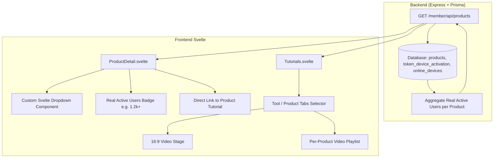

# Product Order & Tutorials Hub Overhaul Implementation Plan

> **For agentic workers:** REQUIRED SUB-SKILL: Use superpowers:subagent-driven-development to implement this plan task-by-task. Steps use checkbox (`- [ ]`) syntax for tracking.

**Goal:** Overhaul the New Order Product Detail page (remove ratings/reviews, show real active user stats, build custom Svelte dropdown, link to tutorials) and refactor Video Tutorials Hub into a product-first interactive selector utilizing database tutorial entries.

**Architecture:** Backend API queries real device/token activation metrics and provides them in `/member/api/products`. Svelte frontend replaces native `<select>` with a custom dropdown component, shows clean active user stats, and refactors `Tutorials.svelte` with product tab/grid selection and per-product video playback.

**Architecture Diagram:**

**Tech Stack:** Svelte 4, Vite 5, TypeScript, Prisma ORM, Express.js.

## Global Constraints
- Keep Express and Svelte unified on port `4829`.
- Do not alter external APIs or backend business logic.
- Real active users must be formatted concisely (e.g., `1.2k+`, `850+`).
- Only use official `tutorials` JSON stored in `products` table.
- Maintain branch `reborn` strictly.

---

### Task 1: Backend Real Active Users Aggregator & API Enhancement

**Files:**
- Modify: `src/controllers/memberController.ts`

**Interfaces:**
- Produces: `products` array with `active_users: number` and `active_users_formatted: string`.

- [ ] **Step 1: Write active user calculation helper**
  Calculate token device activations / online devices per product name or ID.
- [ ] **Step 2: Update `apiGetProducts` & `apiGetDashboard` in `memberController.ts`**
  Map products with aggregated real active users count and format (e.g. `1063` -> `'1.0k+'`, `8642` -> `'8.6k+'`, `32` -> `'30+'`).
- [ ] **Step 3: Run backend typecheck**
  Run: `npx tsc --noEmit`
- [ ] **Step 4: Verify API output**
  Run: `curl http://localhost:4829/member/api/products` and confirm `active_users` and `active_users_formatted`.

---

### Task 2: Custom Svelte Dropdown Component & Product Detail Polish

**Files:**
- Create: `client/src/lib/components/CustomDropdown.svelte`
- Modify: `client/src/lib/pages/ProductDetail.svelte`

**Interfaces:**
- Produces: `<CustomDropdown items={products} bind:selectedId={selectedProductId} />`

- [ ] **Step 1: Build `CustomDropdown.svelte`**
  - Smooth animated popover menu with click-outside listener.
  - Displays product brand icon, title, formatted price, and active indicator.
- [ ] **Step 2: Update `ProductDetail.svelte`**
  - Remove rating (`4.9`) and ulasan (`128 ulasan`).
  - Render real active users badge: `{selectedProduct.active_users_formatted || '1.0k+'} Pengguna Aktif`.
  - Replace `<select>` with `<CustomDropdown />`.
  - In `Informasi Produk` section: Add clickable button/link "Tonton Tutorial Produk Ini" directing to `#/member/tutorials?product_id={selectedProduct.id}`.
- [ ] **Step 3: Test client build**
  Run: `cd client && npm run build`

---

### Task 3: Product-First Video Tutorials Hub Refactor

**Files:**
- Modify: `client/src/lib/pages/Tutorials.svelte`

**Interfaces:**
- Consumes: `/member/api/tutorials` products array with DB `tutorials` JSON.
- URL Query support: `#/member/tutorials?product_id=X`

- [ ] **Step 1: Implement Product Selection Bar/Tabs**
  - Render tool selector tabs (`Semua Produk`, `Affilia`, `Vids`, `AsistenQ Owner`) with product icons and video count badges.
  - If a specific tool is selected or passed via `?product_id=X`, activate it immediately.
- [ ] **Step 2: Render Per-Product Video Playlist & 16:9 Player**
  - Only show the tutorial videos for the selected product.
  - If the product has tutorials (e.g. `Affilia` with 5 videos from DB), load the active video into 16:9 iframe player.
  - If the product has no tutorials in DB, render a sleek placeholder with direct support link.
- [ ] **Step 3: Test client build**
  Run: `npm run build`

---

### Task 4: Automated Browser Verification & Verification Screenshots

**Files:**
- Modify: `scripts/verify-svelte-ui.js`

- [ ] **Step 1: Update test script to verify:**
  - Product Detail page with custom Svelte dropdown opened and active user badge.
  - Tutorials Hub product selection tabs and video playlist.
- [ ] **Step 2: Run automated Chrome DevTools test**
  Run: `node scripts/verify-svelte-ui.js`
- [ ] **Step 3: Inspect generated screenshot artifacts**

---

### Task 5: Git Commit & Push to `reborn`

- [ ] **Step 1: Run linter**
  Run: `npm run lint`
- [ ] **Step 2: Commit changes**
  Run: `git add . && git commit -m "feat: overhaul product detail active users, custom dropdown, and product-based tutorials hub"`
- [ ] **Step 3: Push to branch `reborn`**
  Run: `git push origin reborn`
