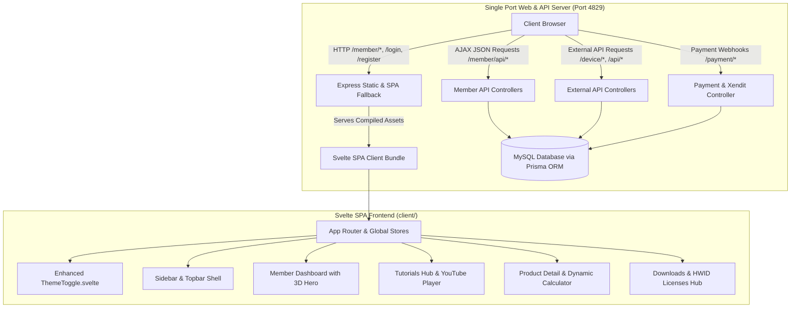

# Svelte Frontend Migration & Enhanced Theme Toggle Implementation Plan

> **For agentic workers:** REQUIRED SUB-SKILL: Use superpowers:subagent-driven-development to implement this plan task-by-task. Steps use checkbox (`- [ ]`) syntax for tracking.

**Goal:** Migrate the Appcenter frontend presentation layer from TypeScript HTML template strings to a modern, reactive Svelte 5 / Svelte + Vite single-page application hosted seamlessly on a single port (`4829`) alongside the existing Node.js Express backend, while replacing the theme switcher with an ultra-sleek, interactive animated component.

**Architecture:** A unified full-stack monorepo where Svelte + Vite (`client/`) compiles into a production-optimized static client bundle served directly by Express (`src/app.ts`) on port `4829`. Express acts as both the single-port web server (serving Svelte SPA via static routing & SPA fallback) and the REST API provider (`/member/api/*`, `/device/*`, `/payment/*`, `/api/v1/*`), keeping 100% of existing DB schemas, license validation, and external API contracts intact.

**Architecture Diagram:**

**Tech Stack:** 
- Frontend: Svelte 5 / Svelte, Vite, TypeScript, TailwindCSS / Custom Theme Tokens (`appcenter-theme.css`)
- Backend: Node.js, Express 5, TypeScript (`tsc`), Prisma ORM, MySQL
- Single-Port Server: Express static file server with SPA wildcard fallback
- Testing & Verification: Headless Google Chrome DevTools MCP automation script

## Global Constraints

- **Single Port Invariant**: Express backend and Svelte frontend MUST run together on a single port (`4829`). No separate dev proxy ports in production or testing.
- **Git Branch Invariant**: All commits and pushes MUST target branch `reborn` (`git push origin reborn`). Never push to `master`.
- **Backend Business Logic Invariant**: Prisma database models, device token activation, Xendit payment webhooks, and SFTP file uploads must NOT be broken or altered.
- **External API Invariant**: Endpoints `/device/*`, `/payment/*`, `/api/v1/*`, `/health`, `/robots.txt` must maintain 100% backward-compatibility.
- **Build Invariant**: `npm run build` must cleanly compile both Svelte frontend (`client/`) and TypeScript backend (`src/`) with exit code 0.

---

### Task 1: Setup Svelte Client Project & Single-Port Express Build Pipeline

**Files:**
- Create: `client/package.json`
- Create: `client/vite.config.ts`
- Create: `client/tsconfig.json`
- Create: `client/index.html`
- Create: `client/src/main.ts`
- Create: `client/src/App.svelte`
- Modify: `package.json`
- Modify: `src/app.ts`

**Interfaces:**
- Consumes: Static assets from `public/` and design tokens from `public/css/appcenter-theme.css`.
- Produces: Compiled Svelte assets in `client/dist` (or `public/app`) served by Express at `app.use(express.static(...))` and wildcard `/member/*` fallback.

- [ ] **Step 1: Initialize Svelte + Vite client directory with dependencies**
  - Setup `client/package.json` with `svelte`, `@sveltejs/vite-plugin-svelte`, `vite`, `typescript`, and `svelte-spa-router` (or hash/history router).
  - Install dependencies using non-interactive `npm install`.

- [ ] **Step 2: Configure Vite build target and base paths**
  - In `client/vite.config.ts`, configure `base: '/'`, `build.outDir: '../client/dist'`, `build.emptyOutDir: true`.

- [ ] **Step 3: Update root `package.json` build scripts for single-port lifecycle**
  - Add `"build:client": "cd client && npm run build"`.
  - Update `"build"` script to build client bundle first, then compile backend with `tsc`.

- [ ] **Step 4: Configure Express SPA Fallback in `src/app.ts`**
  - Register `app.use(express.static(path.join(__dirname, '../client/dist')))` and configure `/member/*`, `/login`, `/register`, `/download` to serve `client/dist/index.html`.

- [ ] **Step 5: Verify build pipeline**
  - Run `npm run build` and ensure both client and server build cleanly.

---

### Task 2: Backend JSON API Endpoints for Member Presentation (`/member/api/*`)

**Files:**
- Modify: `src/controllers/memberController.ts`
- Modify: `src/routes/memberRoutes.ts`

**Interfaces:**
- Consumes: Express request session (`req.session.userEmail`, `userId`), Prisma models (`products`, `order_list`, `token_device_activation`, `device`, `affiliate`).
- Produces: JSON responses for Svelte client endpoints:
  - `GET /member/api/session` -> `{ authenticated: boolean, user: { name, email, avatar } }`
  - `GET /member/api/dashboard` -> `{ products: [...], totalOrders: number, totalLicenses: number }`
  - `GET /member/api/tutorials` -> `{ products: [...] }`
  - `GET /member/api/downloads` -> `{ products: [...], files: [...] }`
  - `GET /member/api/licenses` -> `{ licenses: [...], pagination: {...} }`
  - `GET /member/api/orders` -> `{ orders: [...], pagination: {...} }`
  - `POST /member/api/login`, `POST /member/api/register`, `POST /member/api/orders/create`

- [ ] **Step 1: Add JSON API methods to `memberController.ts`**
  - Add `apiGetSession`, `apiGetDashboard`, `apiGetTutorials`, `apiGetDownloads`, `apiGetLicenses`, `apiGetOrders`.
  - Ensure all methods return standard `{ status: 'success', data: ... }` with proper HTTP status codes.

- [ ] **Step 2: Wire up JSON routes in `src/routes/memberRoutes.ts`**
  - Add `/member/api/*` routes before the wildcard route handler.

- [ ] **Step 3: Test API endpoints using curl**
  - Verify endpoints return valid JSON responses for authenticated and unauthenticated states.

---

### Task 3: Global Svelte Design Tokens, Store & Enhanced ThemeToggle Component

**Files:**
- Create: `client/src/lib/stores/theme.ts`
- Create: `client/src/lib/stores/auth.ts`
- Create: `client/src/lib/components/ThemeToggle.svelte`
- Create: `client/src/lib/styles/theme.css`

**Interfaces:**
- Consumes: `localStorage.getItem('ziqva-theme')` and CSS custom properties (`--page`, `--surface`, `--text`, `--brand`).
- Produces: Reactive Svelte theme store and premium animated ThemeToggle component with smooth sliding pill, glowing sun/moon morph micro-animations, tactile feedback, and ARIA accessibility labels.

- [ ] **Step 1: Build reactive Theme Store (`client/src/lib/stores/theme.ts`)**
  - Implement store syncing `'dark' | 'light'` state to `localStorage` and updating `document.documentElement.setAttribute('data-theme', theme)`.

- [ ] **Step 2: Create Enhanced `ThemeToggle.svelte` Component**
  - Replace the old basic toggle with a state-of-the-art interactive component:
    - Sleek pill track with backdrop blur and subtle border glow.
    - Sliding thumb with spring-like cubic-bezier transition (`transform: translateX(...)`).
    - Dynamic SVG icons: Glowing sun rays with warm amber highlights in Light mode, glowing crescent moon with soft indigo star particles in Dark mode.
    - Hover elevation and active press micro-scale feedback.
    - Smooth, accessible keyboard and click interaction.

- [ ] **Step 3: Import core design system styles into `client/src/lib/styles/theme.css`**
  - Embed the full token set from `public/css/appcenter-theme.css` to guarantee exact visual parity.

---

### Task 4: Svelte Shell Layout, Navigation & Sidebar

**Files:**
- Create: `client/src/lib/components/Sidebar.svelte`
- Create: `client/src/lib/components/Topbar.svelte`
- Create: `client/src/lib/components/Layout.svelte`

**Interfaces:**
- Consumes: Current route path, user session store, enhanced `ThemeToggle.svelte`.
- Produces: Full layout wrapper with sticky topbar, eyebrow "ZIQVA DIGITAL MARKETPLACE", search trigger, help button, responsive mobile drawer, brand mark "Z", active navigation links, and free promo card.

- [ ] **Step 1: Create `Sidebar.svelte`**
  - Implement navigation items (`/dashboard`, `/orders`, `/licenses`, `/tutorials`, `/downloads`, `/affiliate`, `/profile`) with active states and SVG icons.
  - Implement Free Tools promotion box and user profile footer with quick logout.

- [ ] **Step 2: Create `Topbar.svelte`**
  - Include mobile sidebar hamburger trigger.
  - Include brand eyebrow text.
  - Position the newly enhanced `ThemeToggle.svelte` directly to the left of "Cari" and "Butuh bantuan?".
  - Include search modal trigger and quick help link.

- [ ] **Step 3: Create `Layout.svelte`**
  - Combine `Sidebar` + `Topbar` + dynamic slot container into a fluid responsive frame.

---

### Task 5: Svelte Member Dashboard Component

**Files:**
- Create: `client/src/lib/pages/Dashboard.svelte`

**Interfaces:**
- Consumes: Data from `GET /member/api/dashboard`.
- Produces:
  - 3D Welcome Hero with animated cube "Z", glow backdrop, floating status badges, and product counter.
  - 6-Category navigation grid ("Semua Produk", "Automation Bot", "Social Media", "Marketing", "Development", "Tools Gratis").
  - Popular Products Grid with visual color orbits (`blue`, `violet`, `cyan`, `green`, `orange`), ratings, prices, and direct order links.
  - Free Tools section ("Invoice Maker", "Smart Link Shortener").
  - App footer with brand mark "Z" and copyright text.

- [ ] **Step 1: Implement `Dashboard.svelte` template and reactive data fetching**
  - Fetch active products and statistics from `/member/api/dashboard` on mount with clean skeleton loading state.

- [ ] **Step 2: Implement 3D Welcome Hero and Category Grid**
  - Port 3D art markup and CSS styles with reactive counters.

- [ ] **Step 3: Implement Product Orbit Grid & Free Tools Section**
  - Render product cards with price formatting, discount badges, and direct navigation to order checkout.

---

### Task 6: Svelte Tutorial Learning Hub Component

**Files:**
- Create: `client/src/lib/pages/Tutorials.svelte`

**Interfaces:**
- Consumes: Data from `GET /member/api/tutorials`.
- Produces:
  - Header with icon kicker, title, and real-time live search filter.
  - Progress tracker bar ("Progress Belajar: N Materi Video Resmi").
  - Split layout: 16:9 responsive YouTube video stage (left) and interactive numbered lesson playlist (right).
  - Real-time video switching without full page refresh.
  - Support help callout banner.

- [ ] **Step 1: Build `Tutorials.svelte` state & video selector**
  - Manage `selectedVideo`, `searchQuery`, `progress`, and YouTube embed parsing.

- [ ] **Step 2: Implement split stage and lesson playlist**
  - Render 16:9 player iframe and playlist cards with active highlights and lesson numbering (01, 02, etc.).

- [ ] **Step 3: Implement reactive live search**
  - Filter playlist items dynamically as the user types in the search input.

---

### Task 7: Svelte Product Detail & Interactive Order Flow

**Files:**
- Create: `client/src/lib/pages/ProductDetail.svelte`

**Interfaces:**
- Consumes: Product list, query param `?product_id=N`, `POST /member/orders/create`.
- Produces:
  - Breadcrumb navigation.
  - Split detail hero: 3D visual orbit with "BEST SELLER" badge (left) and product config form (right).
  - Reactive duration selector pills (2, 4, 6 Bulan) with instant price recalculation.
  - Voucher discount validator.
  - Product specs list (Masa Aktif, Pengiriman Instan, Personal License).
  - Submit action with redirection to Xendit payment URL.

- [ ] **Step 1: Build `ProductDetail.svelte` with reactive calculation**
  - Implement duration multiplier and coupon validation state.

- [ ] **Step 2: Integrate order submission action**
  - Submit order to backend API and handle redirection to Xendit payment portal.

---

### Task 8: Svelte Downloads, Licenses HWID & Orders Hub

**Files:**
- Create: `client/src/lib/pages/Downloads.svelte`
- Create: `client/src/lib/pages/Licenses.svelte`
- Create: `client/src/lib/pages/Orders.svelte`

**Interfaces:**
- Consumes: Data from `/member/api/downloads`, `/member/api/licenses`, `/member/api/orders`.
- Produces:
  - `Downloads.svelte`: Multi-OS installer buttons (Windows/macOS) with file size chips and modal launcher.
  - `Licenses.svelte`: HWID validation status badges (`Active`, `Not Used`, `Expired`), one-click key copying, machine ID editor modal.
  - `Orders.svelte`: Order transaction table, filter bar, status badges, payment retry links.

- [ ] **Step 1: Implement `Downloads.svelte` with multi-OS filter tabs**
- [ ] **Step 2: Implement `Licenses.svelte` with HWID editor and clipboard copy**
- [ ] **Step 3: Implement `Orders.svelte` with transaction table and pagination**

---

### Task 9: Svelte Auth Pages (Login & Register)

**Files:**
- Create: `client/src/lib/pages/Login.svelte`
- Create: `client/src/lib/pages/Register.svelte`

**Interfaces:**
- Consumes: `POST /member/login`, `POST /member/register`.
- Produces: Clean card auth views with brand mark "Z", enhanced ThemeToggle in the top right, animated form submission, and error handling.

- [ ] **Step 1: Build `Login.svelte` with theme switcher and loading state**
- [ ] **Step 2: Build `Register.svelte` with password confirmation validation**

---

### Task 10: Express SPA Fallback Routing & Single Port Verification

**Files:**
- Modify: `src/routes/memberRoutes.ts`
- Modify: `src/app.ts`

**Interfaces:**
- Consumes: HTTP GET requests to `/member/*`, `/login`, `/register`.
- Produces: Serves compiled `client/dist/index.html` on port `4829`.

- [ ] **Step 1: Update Express route wildcard handling**
  - Ensure any non-API GET request under `/member/*` serves the Svelte SPA shell.

- [ ] **Step 2: Verify server runs seamlessly on single port `4829`**
  - Test simultaneous API request (`curl http://localhost:4829/member/api/dashboard`) and static asset request (`curl http://localhost:4829/member/dashboard`).

---

### Task 11: End-to-End Build & DevTools Automated Browser Verification

**Files:**
- Create: `scripts/verify-svelte-ui.js`

**Interfaces:**
- Consumes: Headless Google Chrome DevTools protocol on `http://localhost:4829`.
- Produces: Automated test run capturing Dark and Light mode screenshots for all views, verifying theme toggle animation, navigation, and API integration.

- [ ] **Step 1: Execute `npm run build`**
  - Confirm client Vite build + server `tsc` build complete with 0 errors.

- [ ] **Step 2: Run `node scripts/verify-svelte-ui.js`**
  - Capture screenshots of Dashboard, Tutorials, Product Detail, Downloads, Licenses in both Dark and Light themes.

- [ ] **Step 3: Visually verify ThemeToggle micro-animation and layout parity**
  - Inspect generated screenshots to confirm enhanced theme toggle aesthetics.

---

### Task 12: Commit and Push to `reborn` Branch

**Files:**
- Modify: `docs/CONTEXT_SNAPSHOT.yaml`
- Modify: `ZIQVA_STORE_ANALYSIS.md`

- [ ] **Step 1: Stage all changes**
- [ ] **Step 2: Commit with conventional commit message (`feat(svelte): migrate frontend presentation layer to svelte with enhanced theme switcher`)**
- [ ] **Step 3: Push strictly to `origin/reborn`**
