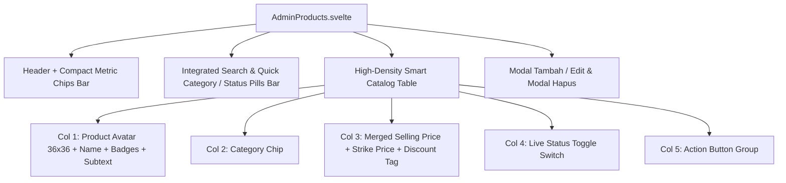

# Modern Compact Catalog Products Page Implementation Plan

> **For agentic workers:** REQUIRED SUB-SKILL: Use superpowers:subagent-driven-development to implement this plan task-by-task. Steps use checkbox (`- [ ]`) syntax for tracking.

**Goal:** Restyle and modernize the Admin Products Catalog page (`AdminProducts.svelte`) into a high-density, compact SaaS table layout with integrated metric chips, unified search/filter pills, merged financial price cells, and streamlined action buttons.

**Architecture:** Refactor `client/src/lib/pages/AdminProducts.svelte` to replace disjointed stat blocks and separate search cards with a cohesive, high-density toolbar. Integrate category/status filter pills and smart-merged product/price cells.

**Architecture Diagram:**

**Tech Stack:** Svelte, TypeScript, Tailwind CSS, Appcenter CSS Theme Custom Properties.

---

### Task 1: Refactor UI Components in `AdminProducts.svelte`

**Files:**
- Modify: `client/src/lib/pages/AdminProducts.svelte`

**Interfaces:**
- Consumes: `ProductsData` (`products`, `categories`, `stats`) from `/admin/api/products`
- Produces: Polished, compact, theme-adaptive SaaS table layout

- [ ] **Step 1: Update State & Filter Logic**:
  Add `statusFilter` (`'all' | 'active' | 'inactive' | 'discount'`), `categoryFilter` (`number | 'all'`), and `sortBy` (`'name' | 'price-asc' | 'price-desc' | 'newest'`) reactive filters.
- [ ] **Step 2: Redesign Header & Metric Chips**:
  Replace 3 bulky boxes with 4 compact, high-contrast metric chips in a streamlined top bar.
- [ ] **Step 3: Build Integrated Search & Pill Filter Bar**:
  Combine search input with horizontal category pills and status filters.
- [ ] **Step 4: Restructure Smart Table Rows**:
  Implement compact 36x36px avatar thumbnails, merged price/discount formatting, interactive status toggles, and unified action icon groups.
- [ ] **Step 5: Polish Modal Forms**:
  Ensure Tambah/Edit and Delete modals maintain consistent clean styling and accessibility.

---

### Task 2: Verification & Testing

**Files:**
- Test: Build & Lint commands (`npm run lint && npm run build`)
- Manual verification across light/dark modes

- [ ] **Step 1: Run linter and build**:
  Run `npm run lint && npm run build`.
- [ ] **Step 2: Commit and push changes**:
  Commit to branch `reborn` and push.
