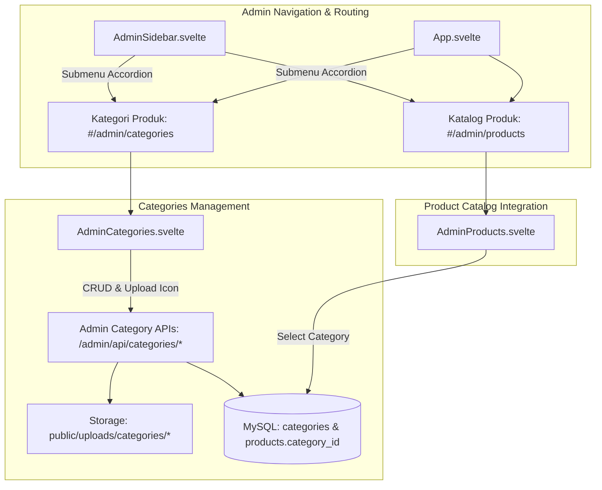

# Product Categories & Admin Submenu Navigation Implementation Plan

> **For agentic workers:** REQUIRED SUB-SKILL: Use superpowers:subagent-driven-development to implement this plan task-by-task. Steps use checkbox (`- [ ]`) syntax for tracking.

**Goal:** Menambahkan sistem kategori produk lengkap dengan icon gambar, deskripsi, dan relasi ke produk, serta merestrukturisasi sidebar navigasi admin dengan submenu accordion untuk menu "Produk" (Katalog & Kategori).

**Architecture:** Tabel `categories` dibuat di MySQL dan dipetakan di Prisma. Endpoint CRUD & upload icon kategori diintegrasikan di Express. Svelte client menambahkan halaman baru `AdminCategories.svelte`, mengupgrade `AdminSidebar.svelte` dengan menu accordion, serta memperkaya `AdminProducts.svelte` dengan relasi kategori.

**Architecture Diagram:**

**Tech Stack:** Svelte 4, Vite 5, TypeScript 5.9, Express.js 5, Multer, Prisma ORM, MySQL.

## Global Constraints
- Single Port Invariant: Port server tetap `4829`.
- Git Branch Invariant: Seluruh commit dan push wajib ditujukan ke branch `reborn`.
- Asset Invariant: File upload icon kategori disimpan di `public/uploads/categories/` dan disajikan via `/uploads/categories/*`.

---

### Task 1: Database Migration & Prisma Schema Update

**Files:**
- Modify: `prisma/schema.prisma`

- [ ] **Step 1: Execute SQL to create `categories` table and add `category_id` to `products`**
- [ ] **Step 2: Update `prisma/schema.prisma` with `model categories` and `products.category_id`**
- [ ] **Step 3: Run `npx prisma generate`**

---

### Task 2: Backend Controller & API Routes for Categories

**Files:**
- Create Directory: `public/uploads/categories/`
- Modify: `src/controllers/adminController.ts`
- Modify: `src/routes/adminRoutes.ts`

**Interfaces:**
- Produces:
  - `GET /admin/api/categories` -> `{ status: 'success', data: { categories: [...] } }`
  - `POST /admin/api/categories/create` -> `{ status: 'success', data: category }`
  - `POST /admin/api/categories/edit/:id` -> `{ status: 'success', data: category }`
  - `POST /admin/api/categories/delete/:id` -> `{ status: 'success', message: string }`
  - `POST /admin/api/categories/toggle-status/:id` -> `{ success: true, is_active: boolean }`
  - `POST /admin/api/categories/upload-icon` -> `{ status: 'success', icon_url: string }`

- [ ] **Step 1: Create `public/uploads/categories/` directory**
- [ ] **Step 2: Implement category CRUD and icon upload methods in `src/controllers/adminController.ts`**
- [ ] **Step 3: Update product CRUD in `src/controllers/adminController.ts` to support `category_id`**
- [ ] **Step 4: Register category routes in `src/routes/adminRoutes.ts`**
- [ ] **Step 5: Verify backend compilation with `npx tsc --noEmit`**

---

### Task 3: Admin Sidebar Restructuring with Products Submenu

**Files:**
- Modify: `client/src/lib/components/AdminSidebar.svelte`

- [ ] **Step 1: Restructure AdminSidebar to make "Produk" an expandable menu item**
- [ ] **Step 2: Add submenu links for "Katalog Produk" and "Kategori Produk" with active indicator**
- [ ] **Step 3: Test responsive navigation and auto-open state**

---

### Task 4: Admin Categories Page (`AdminCategories.svelte`)

**Files:**
- Create: `client/src/lib/pages/AdminCategories.svelte`
- Modify: `client/src/App.svelte`

- [ ] **Step 1: Create `AdminCategories.svelte` with stats, table, live search, and action buttons**
- [ ] **Step 2: Add Add/Edit Category Modal with live icon preview, file upload, name, slug, description**
- [ ] **Step 3: Add Delete Category Modal with product association check**
- [ ] **Step 4: Register route `'/admin/categories': AdminCategories` in `client/src/App.svelte`**
- [ ] **Step 5: Verify client build with `npm run build:client`**

---

### Task 5: Integrate Category in Admin Products Page (`AdminProducts.svelte`)

**Files:**
- Modify: `client/src/lib/pages/AdminProducts.svelte`

- [ ] **Step 1: Load categories in `AdminProducts.svelte`**
- [ ] **Step 2: Add category selector dropdown in Add/Edit Product Modal**
- [ ] **Step 3: Display category badge in Products list table**

---

### Task 6: Automated Verification, Documentation & Git Commit

**Files:**
- Modify: `docs/CONTEXT_SNAPSHOT.yaml`
- Modify: `ZIQVA_STORE_ANALYSIS.md`
- Modify: `walkthrough.md`

- [ ] **Step 1: Run automated test script verifying category creation, icon upload, and product linkage**
- [ ] **Step 2: Run `npm run lint && npm run build` (confirm 0 errors)**
- [ ] **Step 3: Update Context Snapshots (SnapshotVersion: 17 & Snapshot 18)**
- [ ] **Step 4: Commit and push to branch `reborn`**
