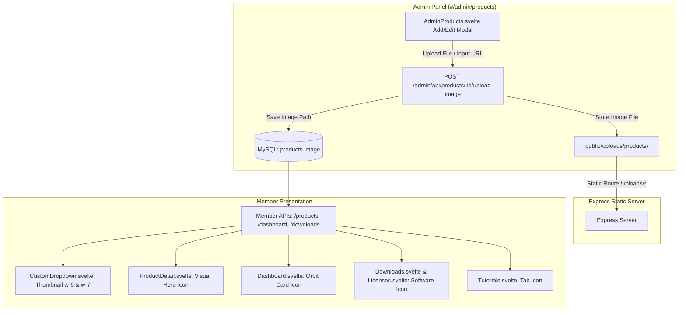

# Product Icons & Images Management Implementation Plan

> **For agentic workers:** REQUIRED SUB-SKILL: Use superpowers:subagent-driven-development to implement this plan task-by-task. Steps use checkbox (`- [ ]`) syntax for tracking.

**Goal:** Menambahkan fitur pengelolaan dan upload icon/gambar produk di panel Admin (`#/admin/products`) serta menampilkan icon produk secara konsisten di seluruh halaman Member (Dropdown, Dashboard, Checkout, Downloads, Tutorials, Licenses).

**Architecture:** File gambar produk diunggah melalui endpoint backend `POST /admin/api/products/:id/upload-image` menggunakan Multer ke direktori `public/uploads/products/` dan dilayani secara statis via `/uploads/products/*`. Svelte frontend mengintegrasikan upload, URL eksternal, dan preset icon, serta merender gambar di semua komponen dengan fallback inisial huruf yang aman.

**Architecture Diagram:**

**Tech Stack:** Svelte 4, Vite 5, TypeScript 5.9, Express.js 5, Multer, Prisma ORM, MySQL.

## Global Constraints

- Single Port Invariant: Express backend dan Svelte client bundle tetap berjalan pada port `4829`.
- Git Branch Invariant: Seluruh commit dan push wajib ditujukan ke branch `reborn`. Jangan push ke `master`.
- Asset Invariant: File upload disimpan di `public/uploads/products/` dan otomatis disalin ke `dist/public/uploads/products/` pada build script.
- Graceful Fallback: Jika gambar kosong atau gagal dimuat (`on:error`), UI wajib menampilkan icon inisial dinamis tanpa merusak tata letak.

---

### Task 1: Backend Image Upload Endpoint & Static Assets Setup

**Files:**
- Create Directory: `public/uploads/products/`
- Modify: `src/app.ts`
- Modify: `src/routes/adminRoutes.ts`
- Modify: `src/controllers/adminController.ts`
- Modify: `package.json`

**Interfaces:**
- Produces: `POST /admin/api/products/:id/upload-image` -> JSON `{ status: 'success', image_url: string, message: string }`
- Static route: `GET /uploads/products/*`

- [ ] **Step 1: Create upload directory and configure static route in `src/app.ts`**
- [ ] **Step 2: Setup Multer middleware and route in `src/routes/adminRoutes.ts`**
- [ ] **Step 3: Implement `uploadProductImage` in `src/controllers/adminController.ts`**
- [ ] **Step 4: Update `package.json` build script to copy uploads directory**
- [ ] **Step 5: Verify backend compilation with `npx tsc --noEmit`**

---

### Task 2: Admin Products Page (`AdminProducts.svelte`) Enhancement

**Files:**
- Modify: `client/src/lib/pages/AdminProducts.svelte`

**Interfaces:**
- Produces:
  1. Product Table thumbnail column with 40x40px avatar and fallback badge.
  2. Add/Edit Product Modal with:
     - Real-time 64x64px live preview box.
     - Direct file upload trigger + loading spinner.
     - Image URL input for external links.
     - Clear/reset image button.

- [ ] **Step 1: Add image state variables & upload handler in `AdminProducts.svelte`**
- [ ] **Step 2: Update Product Table to render product avatar/icon with fallback**
- [ ] **Step 3: Add image upload, URL input, and live preview section in modal**
- [ ] **Step 4: Test client compilation with `cd client && npm run build`**

---

### Task 3: Member Area Presentation Enhancement

**Files:**
- Modify: `client/src/lib/components/CustomDropdown.svelte`
- Modify: `client/src/lib/pages/ProductDetail.svelte`
- Modify: `client/src/lib/pages/Dashboard.svelte`
- Modify: `client/src/lib/pages/Downloads.svelte`
- Modify: `client/src/lib/pages/Tutorials.svelte`
- Modify: `client/src/lib/pages/Licenses.svelte`

**Interfaces:**
- Consumes: `product.image` from API responses.
- Produces: Visual icon rendering with image error fallback across all member views.

- [ ] **Step 1: Update `CustomDropdown.svelte` to render product image with `imgError` fallback**
- [ ] **Step 2: Update `ProductDetail.svelte` hero section to display product icon**
- [ ] **Step 3: Update `Dashboard.svelte` product cards to display product icon**
- [ ] **Step 4: Update `Downloads.svelte`, `Tutorials.svelte`, and `Licenses.svelte` to display product icon**
- [ ] **Step 5: Verify client build with `npm run build`**

---

### Task 4: Automated Verification, Documentation & Git Commit

**Files:**
- Modify: `docs/CONTEXT_SNAPSHOT.yaml`
- Modify: `ZIQVA_STORE_ANALYSIS.md`

- [ ] **Step 1: Run automated API verification script testing image upload and retrieval**
- [ ] **Step 2: Run `npm run lint && npm run build` to confirm 0 errors**
- [ ] **Step 3: Update context snapshots (Version 16 & Snapshot 17)**
- [ ] **Step 4: Commit and push to branch `reborn`**
