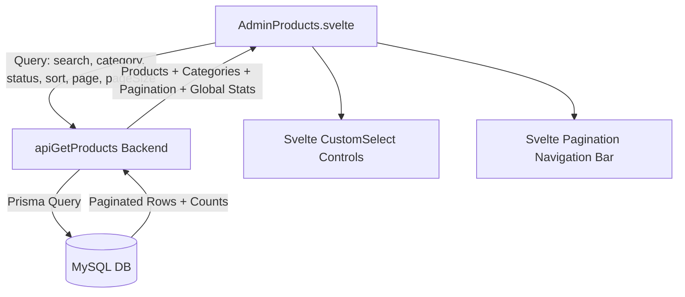

# Server-Side Pagination, Filtering & Svelte Custom Select Implementation Plan

> **For agentic workers:** REQUIRED SUB-SKILL: Use superpowers:subagent-driven-development to implement this plan task-by-task. Steps use checkbox (`- [ ]`) syntax for tracking.

**Goal:** Implement server-side pagination, searching, sorting, and category filtering in `apiGetProducts` and `AdminProducts.svelte`, replacing all native HTML dropdowns with Svelte `CustomSelect` components.

**Architecture:** 
1. Backend `apiGetProducts` builds dynamic Prisma `where` and `orderBy` clauses, computes counts, and returns paginated data with pagination metadata & global stats.
2. Frontend `AdminProducts.svelte` binds to pagination state, executes debounced backend queries, renders page navigation, and uses `CustomSelect` throughout the page.

**Architecture Diagram:**

**Tech Stack:** Svelte, TypeScript, Prisma ORM, Express.

---

### Task 1: Backend Server-Side Query Processing (`src/controllers/adminController.ts`)

**Files:**
- Modify: `src/controllers/adminController.ts`

- [ ] **Step 1: Update `apiGetProducts` logic**:
  Parse `page`, `pageSize`, `search`, `category_id`, `status`, `sort`. Build Prisma `where` with search (name, description, id, product_id), status filter, category filter, and `orderBy`.
- [ ] **Step 2: Fetch paginated products and metadata**:
  Query total count for pagination, global stats counts, and categories list in parallel.
- [ ] **Step 3: Return structured JSON response**:
  Return `products`, `categories`, `pagination`, and `stats`.

---

### Task 2: Frontend Server-Side Pagination & Svelte Dropdown Integration (`client/src/lib/pages/AdminProducts.svelte`)

**Files:**
- Modify: `client/src/lib/pages/AdminProducts.svelte`

- [ ] **Step 1: Wire reactive query state**:
  Add `page`, `pageSize`, `searchQuery`, `statusFilter`, `categoryFilter`, `sortBy`. Add debounced search effect.
- [ ] **Step 2: Replace native HTML `<select>` with `CustomSelect`**:
  Replace Sort select, Page Size select, and Modal Category select.
- [ ] **Step 3: Build Pagination Navigation Controls**:
  Render bottom bar with entry count, `CustomSelect` per-page options (10, 25, 50, 100), and interactive page number buttons.
- [ ] **Step 4: Verify build and test API query execution**:
  Run `npm run lint && npm run build` and run test script.
