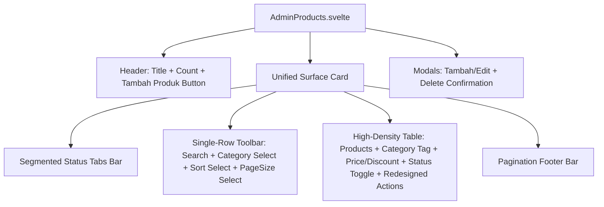

# Unified Enterprise Catalog Products Table Implementation Plan

> **For agentic workers:** REQUIRED SUB-SKILL: Use superpowers:subagent-driven-development to implement this plan task-by-task. Steps use checkbox (`- [ ]`) syntax for tracking.

**Goal:** Transform `AdminProducts.svelte` into a Single Unified Enterprise Table Hub with Segmented Status Tabs, a single-row toolbar (Search, Category `CustomSelect`, Sort `CustomSelect`, Per-Page `CustomSelect`), redesigned modern Action buttons, and a clean pagination footer.

**Architecture:** Refactor `client/src/lib/pages/AdminProducts.svelte` to remove disjointed stat cards and search blocks. Consolidate into a single surface with segmented tabs, unified toolbar, table rows, and footer pagination.

**Architecture Diagram:**

**Tech Stack:** Svelte, TypeScript, Tailwind CSS, Appcenter CSS Theme Custom Properties.

---

### Task 1: Refactor `client/src/lib/pages/AdminProducts.svelte`

**Files:**
- Modify: `client/src/lib/pages/AdminProducts.svelte`

- [ ] **Step 1: Segmented Status Tabs**:
  Build clean segmented status tabs at the top of the unified surface (`Semua`, `Aktif`, `Nonaktif`, `Promo Diskon`).
- [ ] **Step 2: Unified Single-Row Toolbar**:
  Combine Search input, Category filter `CustomSelect`, Sort `CustomSelect`, and Page Size `CustomSelect` into one responsive toolbar.
- [ ] **Step 3: Redesign High-Density Table Rows & Action Buttons**:
  Clean up table cell typography, format category column, and replace action icons with sleek, modern rounded buttons.
- [ ] **Step 4: Pagination Footer**:
  Ensure pagination footer seamlessly integrates with the table card.

---

### Task 2: Verification & Testing

- [ ] **Step 1: Run linter and build**:
  Run `npm run lint && npm run build`.
- [ ] **Step 2: Commit and push changes**:
  Commit to branch `reborn` and push.
