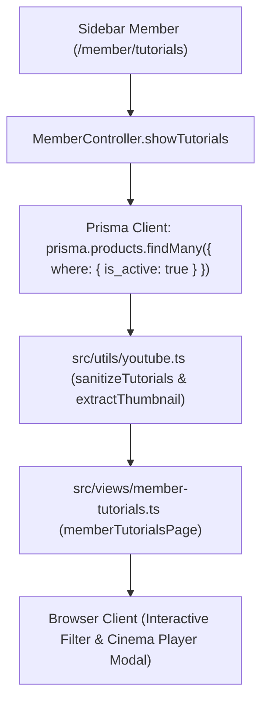

# Design Specification: Member Tutorials Video Learning Hub

**Date:** 2026-08-26  
**Status:** In Review  
**Target URL:** `/member/tutorials`  
**Subsystem:** Member Portal & Product Learning Center  

---

## 1. Overview & Goals

Menyediakan halaman pusat pembelajaran video tutorial resmi (**Video Learning Hub**) di area member. Halaman ini mengumpulkan seluruh panduan video produk, shorts, dan playlist YouTube dari produk aktif ke dalam antarmuka visual yang terintegrasi, responsif, dan mudah diakses.

### Tujuan Utama:
1. Akses cepat dari sidebar member melalui menu baru **"Tutorial Video"** (`/member/tutorials`).
2. Tampilan kartu visual beresolusi tinggi dengan thumbnail resmi YouTube, badge durasi/tipe (Video / Playlist), nama produk, dan judul tutorial.
3. Filter interaktif berdasarkan nama produk, live search kata kunci judul, dan tab kategori (Semua, Single Video, Playlist).
4. Pemutar video responsif (**Theatre/Cinema Modal Player**) dengan aspect ratio 16:9, playlist navigation drawer di sisi samping/bawah, auto-stop saat modal ditutup, serta tombol pintas ke halaman **Download Hub** & **Lisensi Aplikasi**.

---

## 2. Architecture & Data Flow

### Data Extraction & Formatting:
- Model database: `products.tutorials` (JSON string berformat `ProductTutorialItem[]`).
- Helper parser: `sanitizeTutorials(product.tutorials)` dari `src/utils/youtube.ts`.
- Thumbnail URL:
  - Video biasa: `https://img.youtube.com/vi/${videoId}/hqdefault.jpg` (fallback `mqdefault.jpg`).
  - Playlist: `https://img.youtube.com/vi/${videoId || 'default'}/hqdefault.jpg` atau placeholder thumbnail bertema gelap.
- Relasi produk: ID produk, nama produk, link download installer, dan tutorial ID.

---

## 3. UI/UX Specification

### A. Sidebar Navigation (`src/views/components/member-sidebar.ts`):
- Menambahkan item menu baru di antara **"Lisensi Aplikasi"** dan **"Download Hub"**:
  - Label: `Tutorial Video`
  - URL: `/member/tutorials`
  - Active key: `tutorials`
  - Icon SVG: Academic/Play Video Icon (clean Crisp SVG).

### B. Header & Summary Stats:
- Banner sambutan dengan statistik:
  - Total video tutorial aktif.
  - Jumlah produk yang memiliki panduan video.
  - Jumlah playlist lengkap.
- Live search bar dengan input debounce responsif.
- Product filter pills (tombol horizontal scrollable untuk memilih spesifik produk).

### C. Video Card Grid:
- Grid layout responsif (1 kolom di mobile, 2 kolom di tablet, 3-4 kolom di desktop).
- Elemen kartu:
  - **Thumbnail Container**: 16:9 aspect ratio dengan overlay hover effect dan tombol Play glowing.
  - **Badge Tipe**: `🎬 Video` (Biru) atau `📑 Playlist (N part)` (Ungu).
  - **Product Tag**: Nama produk dengan background badge gelap semi-transparan.
  - **Judul Video**: Judul tutorial dengan tooltip atau text truncate 2-baris.
  - **Action Footer**: Tombol "Putar Tutorial" dan tombol "Buka di YouTube ↗".

### D. Cinema Modal Player (`#tutorialCinemaModal`):
- Modal glassmorphism dengan backdrop blur gelap.
- Split layout:
  - **Sisi Kiri (70%)**: 16:9 Responsive YouTube Iframe Embed dengan `allow="accelerometer; autoplay; clipboard-write; encrypted-media; gyroscope; picture-in-picture; web-share"` dan `referrerpolicy="strict-origin-when-cross-origin"`.
  - **Sisi Kanan (30%)**: Interactive Playlist Drawer (daftar video dalam seri/produk yang sama, klik untuk ganti video secara instan tanpa reload).
- Footer info: Nama produk, link ke `/member/downloads` untuk download installer, dan link ke `/member/licenses` untuk cek lisensi.
- Close handler: Membersihkan `iframe.src` agar audio/video langsung berhenti seketika saat modal ditutup.

---

## 4. Security & Quality Guardrails

1. **Auth Protection**: Dilindungi middleware session member (`isMemberAuthenticated`).
2. **XSS Protection**: Parsing URL YouTube diverifikasi ketat oleh regex `youtube.com` / `youtu.be`.
3. **Responsive Design**: Mendukung layar mobile (375px), tablet (768px), hingga desktop ultra-wide (1920px).
4. **Zero AI Slop**: Desain bersih, kontras warna tajam (slate-900 / blue-500 / purple-500), tanpa elemen dekoratif berlebihan.

---

## 5. File Inventory & Modifications

| File | Tindakan | Deskripsi |
| :--- | :--- | :--- |
| `src/views/components/member-sidebar.ts` | **MODIFY** | Tambah link & icon menu "Tutorial Video" (`/member/tutorials`). |
| `src/routes/memberRoutes.ts` | **MODIFY** | Daftarkan route `GET /member/tutorials`. |
| `src/controllers/memberController.ts` | **MODIFY** | Tambahkan method `showTutorials(req, res)` yang mengambil produk & tutorial dari Prisma. |
| `src/views/member-tutorials.ts` | **NEW** | Template SSR halaman Video Learning Hub + Cinema Modal Player + filter script. |
| `src/utils/youtube.ts` | **MODIFY** | Tambahkan helper thumbnail extraction `getYouTubeThumbnail(url, embedUrl)`. |
