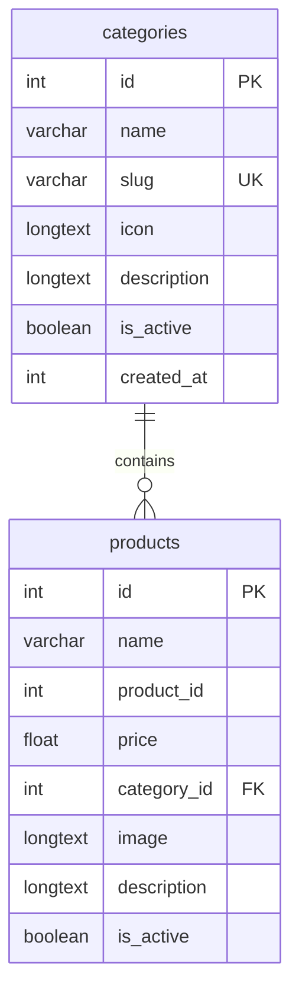

# Design Specification: Product Categories with Icon, Description, and Admin Submenu Navigation

**Date:** 2026-08-27  
**Status:** Approved  
**Target:** Product Categories Management & Admin Navigation UX  
**Subsystem:** Database, Backend APIs, Admin Navigation, and Categories Catalog Page  

---

## 1. Overview & Goals

Menyediakan sistem kategori produk lengkap dengan pengelolaan icon gambar, deskripsi, status aktif, dan jumlah produk terasosiasi. Restrukturisasi navigasi sidebar administrator menghadirkan menu grup **Produk** dengan submenu **Katalog Produk** dan **Kategori Produk**.

---

## 2. Architecture & Data Model

---

## 3. UI/UX Specification

### A. Admin Sidebar Navigation (`AdminSidebar.svelte`):
- Menu **Produk** bertindak sebagai expandable accordion:
  - Header item: Icon kubus produk + label "Produk" + chevron expand/collapse arrow.
  - Submenu container (dengan animasi expand halus):
    1. **Katalog Produk** (`#/admin/products`)
    2. **Kategori Produk** (`#/admin/categories`)
  - Auto-open saat rute berada di salah satu halaman produk/kategori.

### B. Admin Categories Page (`AdminCategories.svelte` - `#/admin/categories`):
1. **Overview & Header**:
   - Judul: "Kategori Produk", subjudul ringkas, tombol "Tambah Kategori".
   - Stats Card: Total Kategori, Kategori Aktif, Total Produk Terkategori.
   - Search bar live filter berdasarkan nama dan deskripsi kategori.
2. **Tabel Kategori**:
   - Kolom:
     - **Icon & Nama**: Avatar icon persegi `40x40px rounded-xl` dengan fallback inisial dinamis + nama kategori + slug badge.
     - **Deskripsi**: Deskripsi singkat kategori.
     - **Jumlah Produk**: Badge counter menampilkan banyaknya software di kategori tersebut.
     - **Status**: Toggle status aktif/nonaktif langsung.
     - **Aksi**: Tombol Edit dan Hapus.
3. **Modal Tambah & Edit Kategori**:
   - Nama Kategori (auto-fill slug).
   - Slug Kategori (URL-friendly string).
   - Icon Section: Live preview box `64x64px`, tombol upload file (PNG, JPG, WEBP, SVG max 2MB), dan input URL alternatif.
   - Deskripsi Kategori (textarea).
   - Checkbox Status Aktif.
4. **Modal Hapus Kategori**:
   - Peringatan protektif jika terdapat produk yang masih menggunakan kategori tersebut.

### C. Admin Products Catalog Page (`AdminProducts.svelte`):
- Dropdown pemilihan kategori software pada modal Tambah / Edit Produk.
- Badge nama kategori pada tabel daftar produk.

---

## 4. Backend & API Endpoints

1. **Table Creation & Prisma Migration**:
   - `categories` table di MySQL.
   - `category_id` column di `products`.
2. **Endpoints**:
   - `GET /admin/api/categories`: Mengambil daftar kategori beserta `products_count`.
   - `POST /admin/api/categories/create`: Membuat kategori baru.
   - `POST /admin/api/categories/edit/:id`: Mengupdate kategori.
   - `POST /admin/api/categories/delete/:id`: Menghapus kategori.
   - `POST /admin/api/categories/toggle-status/:id`: Toggle status aktif kategori.
   - `POST /admin/api/categories/upload-icon` & `POST /admin/api/categories/:id/upload-icon`: Upload icon kategori ke `public/uploads/categories/`.
   - `GET /member/api/categories`: Mengambil daftar kategori publik/member.
